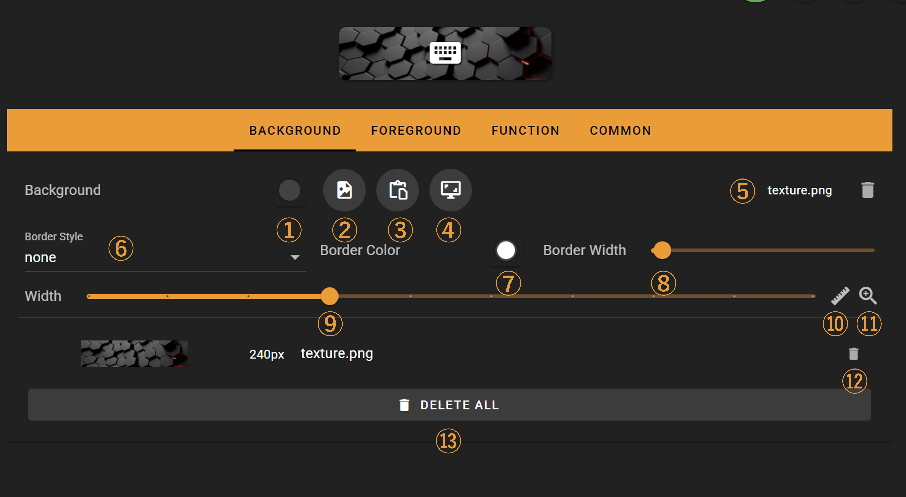
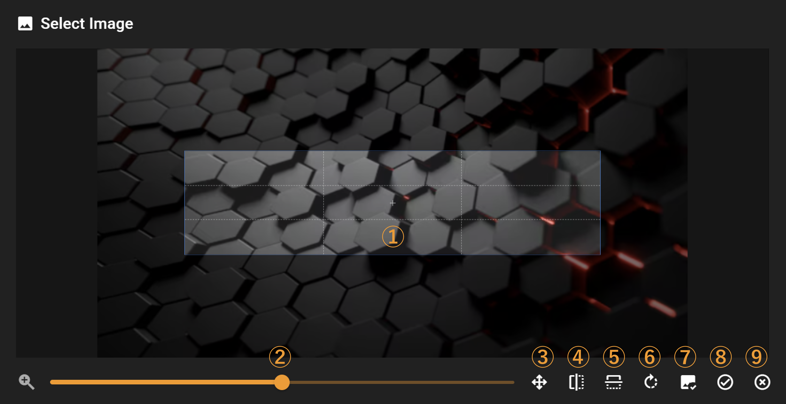
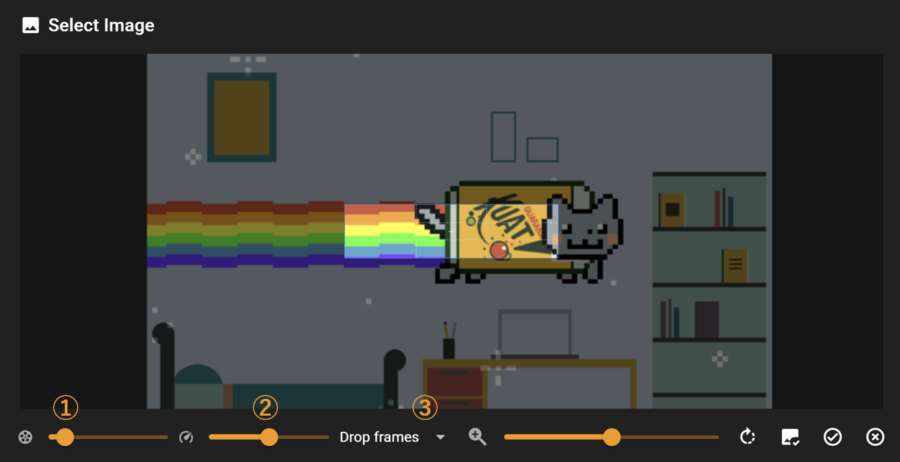

# Edit Background

This document describes how to customize a button's background, including background images, borders, colors, and other parameters.

## Interface Overview

The following features are available:

1. Background color selection
2. Open an image file as background (supports jpg, png, and gif formats)
3. Import image from clipboard as background
4. Capture a portion of the screen as background
5. Current image filename with delete button to remove the background image
6. Border style selection (supports single solid line, double solid line, dotted line, and 3D styles)
7. Border color selection
8. Border width slider
9. Button width slider
10. Toggle button width slider step size (switches between 60px and 10px)
11. Toggle maximum adjustable button width (switches between 600px and 2170px)
12. Imported background image gallery with delete buttons for individual images
13. Delete all imported images

### Image Editing

When importing a background image, you can crop the image

The following features are available:

1. Image cropping frame (dimensions match current button width, height is fixed)
2. Image zoom slider (mouse wheel can also be used for zooming)
3. Auto-scale image to fit
4. Horizontal image flip
5. Vertical image flip
6. Clockwise image rotation
7. Use original image without cropping or modifications (useful when your prepared image matches the button dimensions exactly)
8. Apply changes and import image
9. Discard changes

When importing a GIF animation, you can adjust playback speed and other parameters

The following features are available:

1. Frame rate adjustment (up to 30fps)

   > Note: Due to performance limitations, higher frame rates may cause lag
   >
2. Speed adjustment for GIF playback
3. GIF adjustment strategy:
   - Drop frames: Excess keyframes will be discarded when adjusting frame rate
   - Extend frames: No frames will be discarded, but the final GIF playback duration may be longer than expected
