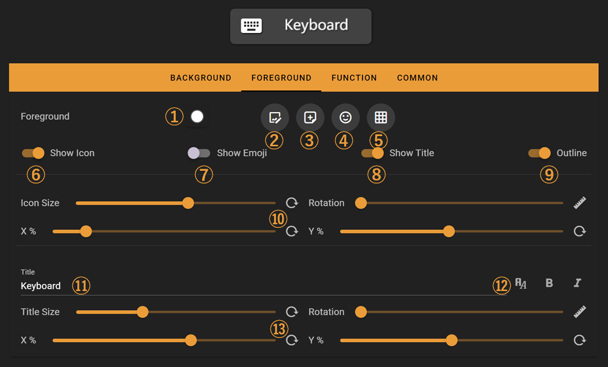
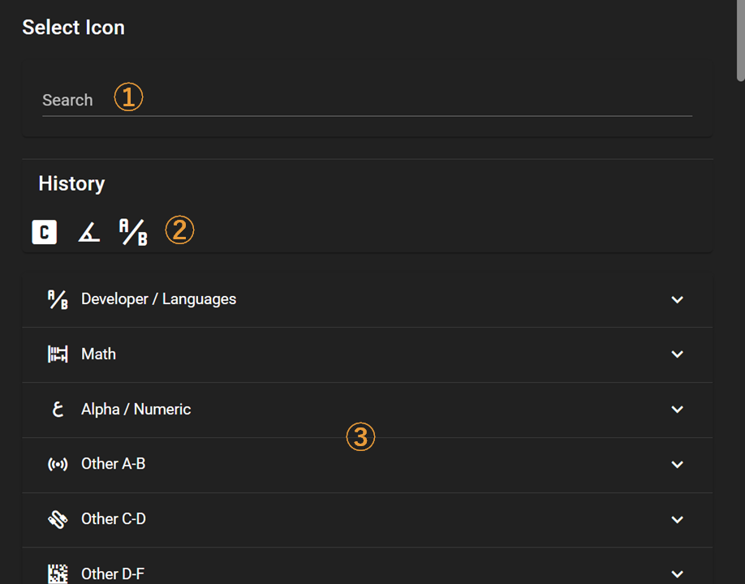
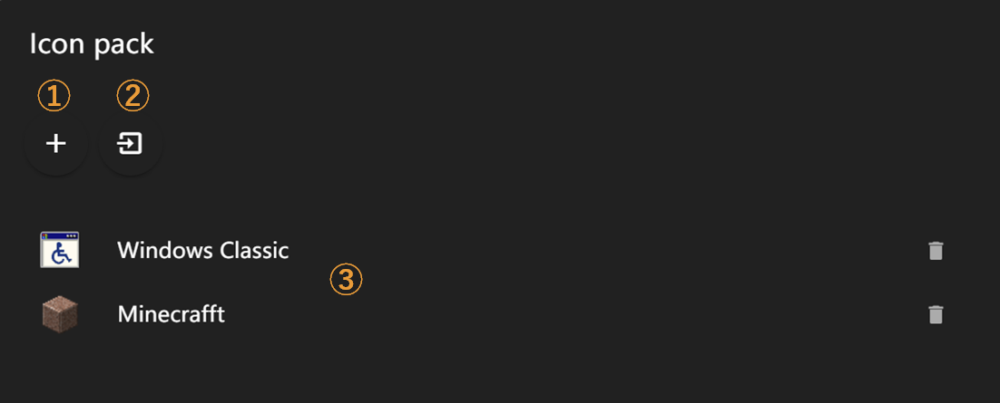
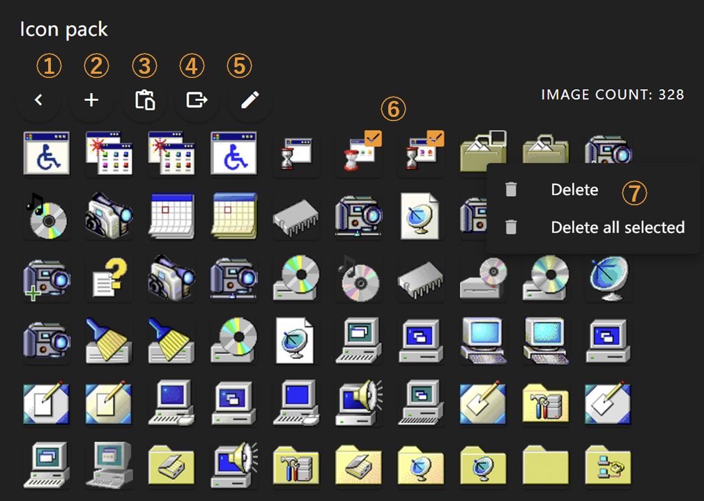
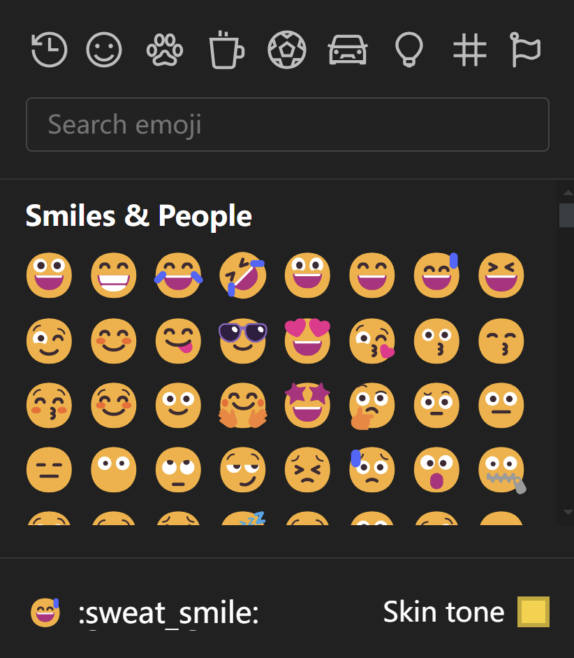
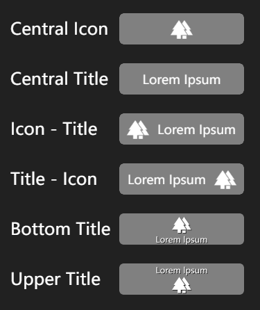
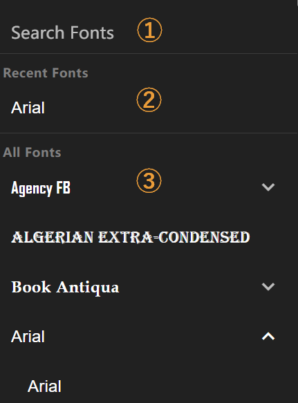

# Edit Foreground

This document describes how to customize the foreground of a key, including its icon, text, shadow, and other visual elements.

## Interface Overview

Feature Overview:

1. Foreground Color Settings
2. Built-in Icon Selector
3. Custom Icon Selector
4. Emoji Selector
5. Preset Layout Selector
6. Show Icon (mutually exclusive with Show Emoji)
7. Show Emoji (mutually exclusive with Show Icon)
8. Show Title
9. Show Shadow
10. Icon Parameter Settings - Adjust icon size, rotation, and XY-axis position using sliders
11. Title Edit Box - Supports multi-line text
12. Title Font Settings - Adjust title font, bold, and italic styles
13. Title Parameter Settings - Adjust title size, rotation, and XY-axis position using sliders

## Built-in Icon Selector

Click ② in the foreground editing interface to open the built-in icon selector.

The built-in icon selector contains over 7,000 icons organized by category.

Feature Overview:

1. Icon Search - Search by icon code or keywords
2. Icon History - Recently selected icons appear here
3. Icon Category Browser - Click to open icon categories, scroll down to view more categories

## Custom Icon Selector

Click ③ in the foreground editing interface to open the custom icon selector.

Feature Overview:

1. Create a new icon pack
2. Import an icon pack from file (.iconpack)
3. Icon Pack List - Click to enter the respective icon pack

After clicking ③ on the previous page, you'll enter the icon selection page. Feature Overview:

1. Return to previous page
2. Open image files to add as icons - supports adding multiple icons at once
3. Import images from clipboard to add as icons
4. Export current icon pack to file (.iconpack)
5. Edit current icon pack title and description
6. Hover over any icon to click and use, or use selection box for multiple icon selection
7. Right-click on icons to open menu - delete current icon or multiple selected icons

## Emoji Selector

Click ④ in the foreground editing interface to open the Emoji selector, where you can choose your favorite Emojis to use as icons.

> Note: Emoji appearance may vary across different operating systems

## Preset Layout Selector

Click ⑤ in the foreground editing interface to open the preset layout selector, which offers several common icon-title layouts for direct use.

## Font Selector

Click ⑫ in the foreground editing interface to open the font selector.

Feature Overview:

1. Font Search Box - Search for font names
2. Recently Used Fonts - Your recently selected fonts appear here
3. Font List - Preview font appearances directly, with multiple font styles shown in submenus if available
