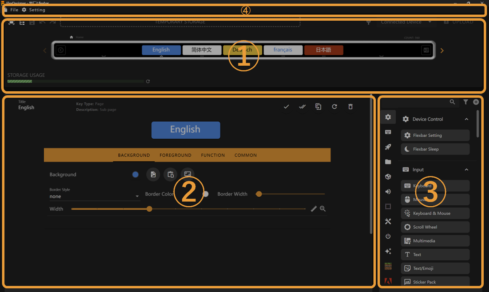
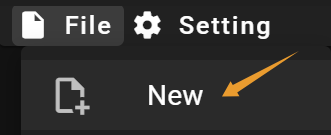
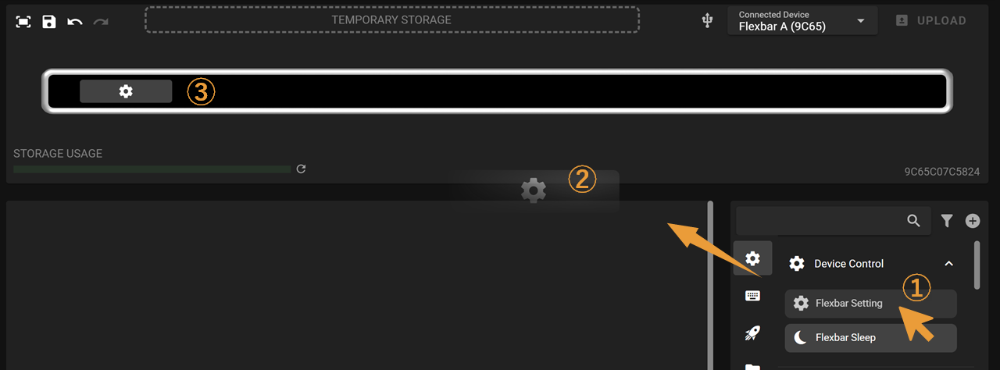
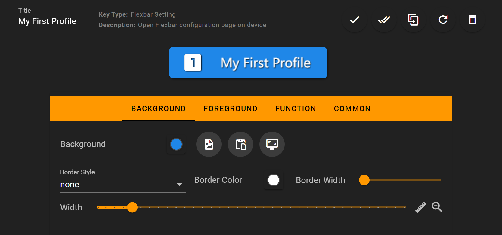
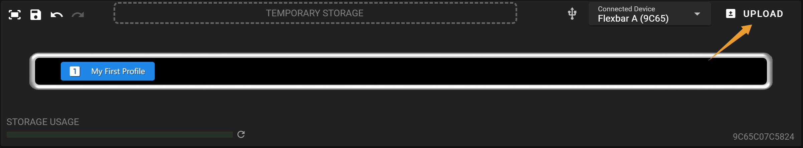

# Getting Started

This documentation introduces the layout, features, and usage of FlexDesigner.

## Overview

The main interface of FlexDesigner consists of three sections:

1. [Page Editor](page_editor.md): This area displays the same effects as Flexbar, allowing you to preview and adjust each interface of Flexbar
2. [Key Editor](key_editor.md): Here you can edit the appearance and functionality of keys
3. [Key Library](key_library.md): Lists all preset/imported keys that you can drag and drop into the page editor or key editor
4. [Toolbar](toolbar.md): Contains file management, software configuration, and other functions.

## Your First Profile

#### **Create a New Profile**

#### **Add a Key**

1. Select a key from the Key Library and click to drag it out
2. Drag the key to the Page Editor
3. Release the mouse to place the key in an appropriate position

#### **Make Some Changes**

> You can check the [Key Editor](key_editor.md) to learn how to customize keys

#### Upload to Device

#### All Done!

You can now see this page on your Flexbar!

## Next Steps

- Visit the [Create My First Profile](../troubleshoting/create_my_first_profile.md) to learn how to create a profile for an application
- Visit the [Background](background.md) and [Foreground](foreground.md) to learn how to customize a key
