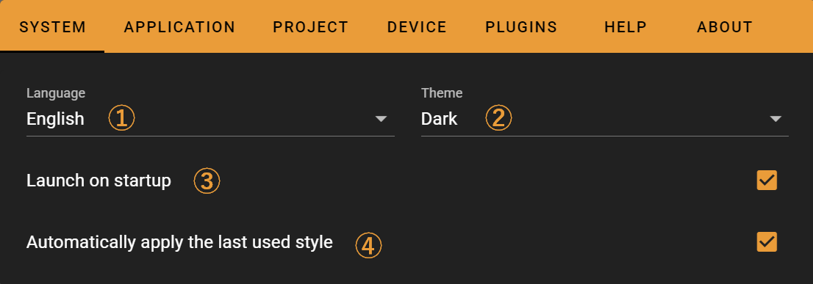
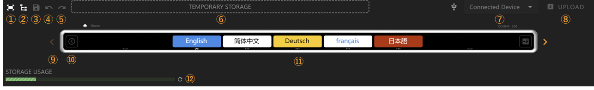
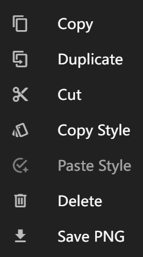
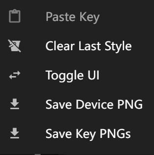

# Getting Started

This documentation introduces the layout, features, and usage of FlexDesigner.

## Interface Overview

The main interface of FlexDesigner consists of three sections:

1. Page Editor: This area displays the same effects as Flexbar, allowing you to preview and adjust each interface of Flexbar
2. Key Editor: Here you can edit the appearance and functionality of keys
3. Key Library: Lists all preset/imported keys that you can drag and drop into the page editor or key editor

## Toolbar

The toolbar contains file management, software configuration, and other functions.

### File

Functions in order:

1. Create a new project file (.flexbar)
2. Open a project file
3. Save current changes to file
4. Save as
5. Export current page to file (.flexpage)
   > Will use the parent page's title and icon
6. Import a page from file

### Settings

In the settings interface, you can manage software, projects, devices, and more.

#### System

1. Set software language
2. Set software theme color
3. Set auto-start on boot
4. If checked, new keys will use the last edited appearance; otherwise, default appearance will be maintained

#### Application

Manage global settings for different applications and your logged-in accounts.

#### Project

Browse and modify project settings on this page.

1. Vertical Mode: When enabled, all key icons and titles will rotate 90°
   > This mode may cause issues with some keys
2. List of plugins installed in the current project

#### Device

Manage connected devices on this page.

Interface description:

1. Connected device list
2. Device information overview
3. Device settings
4. Manual firmware update
   > You typically don't need to manually update firmware

Device settings page ③ is shown below, where you can change the device name and color.

#### Plugins

#### Help

Access the tutorial guide, online documentation, or report bugs on this page.

#### About

Check for software version updates on this page.

## Page Editor

In the page editor, you can manage Flexbar devices, preview and edit pages. You can use the mouse wheel to zoom and drag the virtual Flexbar.

 Feature descriptions:

1. Fit to screen: Click to reset Flexbar's zoom level and position
2. Tree view: Click to browse all subpages and keys in a tree structure for quick navigation between multiple subpages
3. Save your changes
4. Undo
5. Redo
6. Key temporary storage: You can temporarily store keys here for later use
7. Device overview: Select devices to download here
8. Download configuration to device
9. Page scroll: When elements exceed page width, use the scroll buttons on both sides to browse the interface
10. Drawer button: Click to open the drawer. Keys in the drawer won't change with the main page and can be used for frequently used keys
11. Preview interface: Drag to reorder keys or drag new keys from the key library
12. Storage status indicator: Your configuration is saved to Flexbar, showing storage space usage. Keys don't use much storage, but GIFs do

### Key Submenu

Right-click on a key to open the menu.

Functions in order:

1. Copy current key
2. Create a duplicate of current key on current page
3. Cut current key
4. Copy current key's appearance
5. Paste copied appearance to current key
6. Delete current key
7. Save current key as image (not applicable to some keys)

### Page Submenu

Right-click anywhere in the page editor to open the page submenu.

Functions in order:

1. Paste copied keys to current page
2. Clear auto-remembered styles
3. Close virtual UI
4. Save current page as image (not applicable to some keys)
5. Save each key as a separate image (not applicable to some keys)

## Key Editor

Edit key appearance and functionality in the key editor.

Feature descriptions:

1. Key title
2. Key function description
3. Confirm changes
4. Apply current key's appearance settings to other keys
5. Create a duplicate of current key
6. Discard all changes
7. Delete current key
8. Key edit preview
9. Switch to key background editing interface. For detailed information, see [Background Editing Interface](./background.md)
10. Switch to key foreground editing interface. For detailed information, see [Foreground Editing Interface](./foreground.md)
11. Switch to key function editing interface. This interface varies according to key function. See [Key Function Documentation](../functions/index.rst)
12. Switch to key general function editing interface, such as long-press trigger settings

In interface ④ for applying appearance settings to other keys, you can select specific appearance settings to apply and the application scope.

## Key Library

The key library lists all available keys that you can drag and drop into the editor.

Feature descriptions:

1. Key search
2. Key category filter toggle: Enable or disable a key library here
3. Import a key library or plugin from file or link
4. Key library quick navigation: Click to jump to the corresponding key library
5. Key library: Click to collapse or expand, supports nested sub-key libraries
6. Keys: Drag and drop keys to the editor
