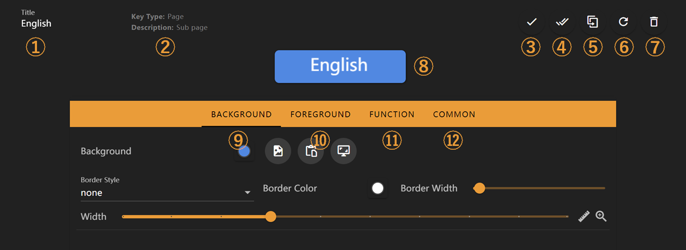
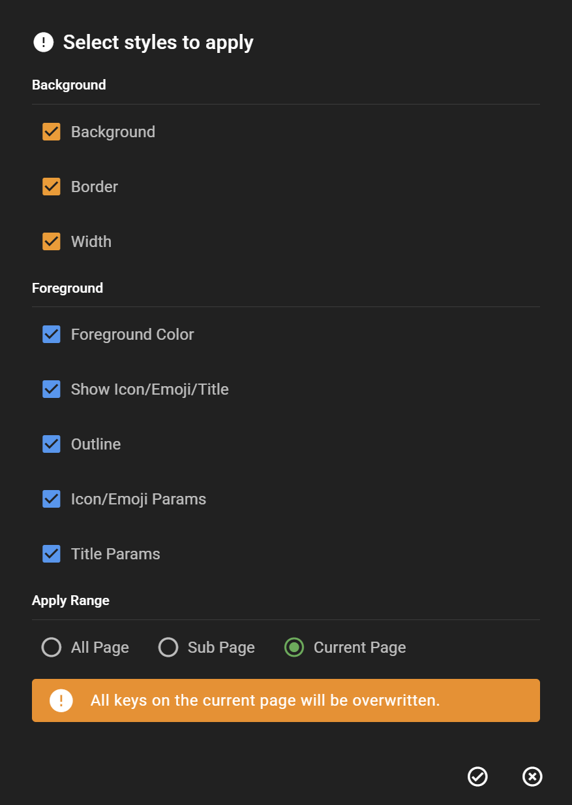

# Key Editor

Edit key appearance and functionality in the key editor.

Feature descriptions:

1. Key title
2. Key function description
3. Confirm changes
4. Apply current key's appearance settings to other keys
5. Create a duplicate of current key
6. Discard all changes
7. Delete current key
8. Key edit preview
9. Switch to key background editing interface. For detailed information, see [Background Editing Interface](./background.md)
10. Switch to key foreground editing interface. For detailed information, see [Foreground Editing Interface](./foreground.md)
11. Switch to key function editing interface. This interface varies according to key function. See [Key Function Documentation](../functions/index.rst)
12. Switch to key general function editing interface, such as long-press trigger settings

In interface ④ for applying appearance settings to other keys, you can select specific appearance settings to apply and the application scope.

## Next Steps

- Visit the [Background](background.md) and [Foreground](foreground.md) to learn how to customize a key
