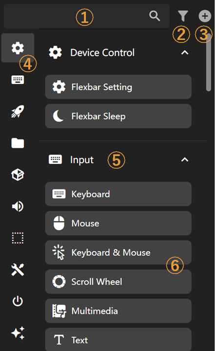

# Key Library

The key library lists all available keys that you can drag and drop into the editor.

Feature descriptions:

1. Key search
2. Key category filter toggle: Enable or disable a key library here
3. Import a key library or plugin from file or link
4. Key library quick navigation: Click to jump to the corresponding key library
5. Key library: Click to collapse or expand, supports nested sub-key libraries
6. Keys: Drag and drop keys to the editor

> Imported `flexpages` and installed plugins will also be displayed here
