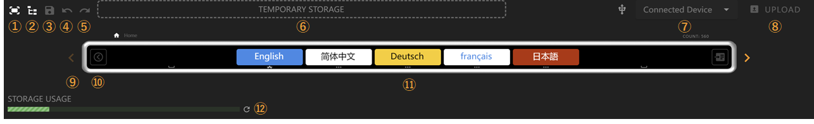
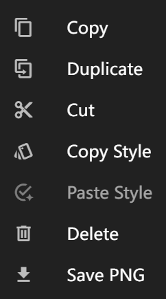
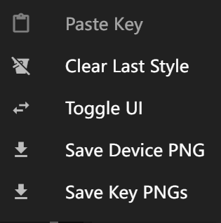

# Page Editor

In the page editor, you can manage Flexbar devices, preview and edit pages. You can use the mouse wheel to zoom and drag the virtual Flexbar.

 Feature descriptions:

1. Fit to screen: Click to reset Flexbar's zoom level and position
2. Tree view: Click to browse all subpages and keys in a tree structure for quick navigation between multiple subpages
3. Save your changes
4. Undo
5. Redo
6. Key temporary storage: You can temporarily store keys here for later use
7. Device overview: Select devices to upload here
8. Upload configuration to device
9. Page scroll: When elements exceed page width, use the scroll buttons on both sides to browse the interface
10. Drawer button: Click to open the drawer. Keys in the drawer won't change with the main page and can be used for frequently used keys
11. Preview interface: Drag to reorder keys or drag new keys from the key library
12. Storage status indicator: Your configuration is saved to Flexbar, showing storage space usage. Keys don't use much storage, but GIFs do

## Key Submenu

Right-click on a key to open the menu.

Functions in order:

1. Copy current key
2. Create a duplicate of current key on current page
3. Cut current key
4. Copy current key's appearance
5. Paste copied appearance to current key
6. Delete current key
7. Save current key as image (not applicable to some keys)

## Page Submenu

Right-click anywhere in the page editor to open the page submenu.

Functions in order:

1. Paste copied keys to current page
2. Clear auto-remembered styles
3. Close virtual UI
4. Save current page as image (not applicable to some keys)
5. Save each key as a separate image (not applicable to some keys)
