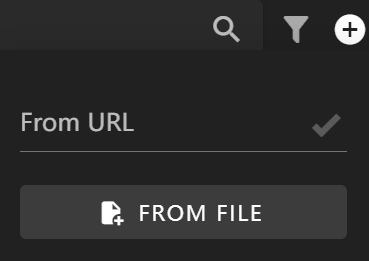

# Plugins

This document explains how to use the plugin functionality in FlexDesigner, which allows you to add more customized features to FlexDesigner.

If you have programming knowledge, you can also develop your own plugins based on our [PluginSDK](../sdk/getting_started.md).

## Importing a Plugin

You can click the + button in the top right corner of the button library to import a plugin from a link or file. The file must be a packaged .flexplugin file, and the link must point to a properly structured GitHub repository, such as https://github.com/ENIAC-Tech/Plugin-ScreenMirror.

After importing, the plugin will be displayed as a button library.

You can drag buttons from the plugin to the editing area and use them just like built-in buttons.

You can also manage the global settings of the plugin (if available) under the Applications tab in the settings interface.

## Managing Plugins

Click the information button to view detailed information about the plugin. Here you can update or delete the plugin.

You can check which plugins are being used in the current project under the Project tab in the settings interface. If versions don't match or plugins are missing, you will be prompted to install them.

You can view and manage all installed plugins under the Plugins tab in the settings interface.

