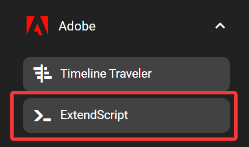
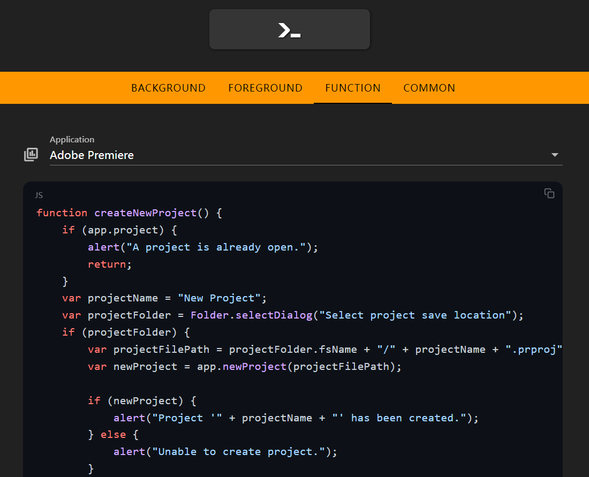

# Adobe ExtendScript

This document explains how to run ExtendScript in Adobe applications with a single click.

## In the FlexDesigner

You can find this feature under the "Adobe" category in the Key Library.

Select the target Adobe application you want to run the script on, then edit your script in the code editor below.

## On the Flexbar

Once uploaded to the Flexbar, simply click the corresponding key to execute the assigned ExtendScript.
