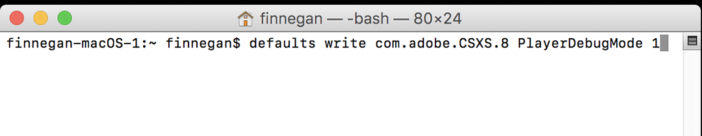

# Adobe Get Started

This document explains how to install the FlexLink plugin into your Adobe applications to use Flexbar’s Adobe integration features.

> Since the FlexLink plugin is built using the legacy Adobe CEP framework, it may not run properly on Apple Silicon devices. We’re actively working on a new UXP version to replace it.

## Enable Developer Mode

First, update the following Adobe setting to prevent your host application (Photoshop, InDesign, etc.) from showing warnings about unsigned extensions. Refer to the [HTML Extension Cookbook](https://github.com/Adobe-CEP/CEP-Resources/blob/master/CEP_8.x/Documentation/CEP%208.0%20HTML%20Extension%20Cookbook.md) section on [Debugging Unsigned Extensions](https://github.com/Adobe-CEP/CEP-Resources/blob/master/CEP_8.x/Documentation/CEP%208.0%20HTML%20Extension%20Cookbook.md#debugging-unsigned-extensions) for more details:

> **Windows**: Open **regedit** and navigate to `HKEY_CURRENT_USER/Software/Adobe/CSXS.<X>`. Add a new string value named `PlayerDebugMode` and set it to `1`.
>
> ⚠️ Make sure there are no extra spaces in `PlayerDebugMode`.

> **Mac**: Open **Terminal** and run:
> `defaults write com.adobe.CSXS.8 PlayerDebugMode 1`

*On Windows, Regedit is located at `C:\Windows\regedit`. You can open it from CMD or by pressing `WIN + R` and typing `regedit`.*

*On macOS, Terminal is located at `Applications > Utilities > Terminal`.*

## Install the FlexLink Plugin

Download and extract the [FlexLink](../../../assets/com.eniac.FlexLink-1.0.zip) archive. Copy the `com.eniac.FlexLink-1.0` folder to the appropriate directory:

> The paths below are the default install locations for the 2025 versions. Adjust them as needed for your setup.

- **Adobe Premiere Pro**:`C:\Program Files\Adobe\Adobe Premiere Pro 2025\CEP\extensions`
- **Adobe Photoshop**:
  `C:\Program Files\Adobe\Adobe Photoshop 2025\Required\CEP\extensions`

## Verify Installation

After launching your Adobe application, go to `Window > Extensions` and look for `Flex Link`.

You’re all set! Flexbar’s Adobe integration is now ready to use.
