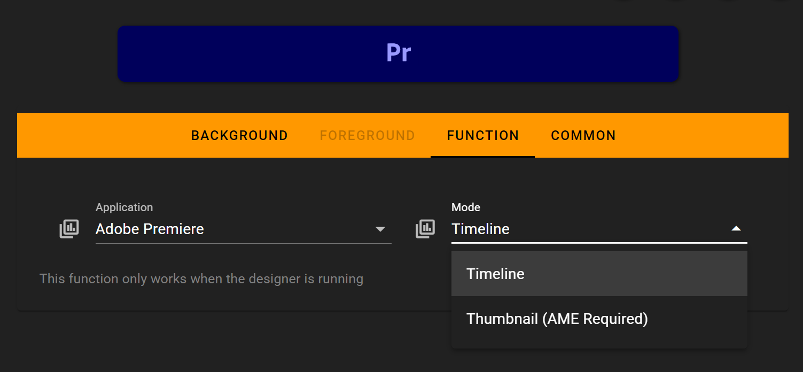
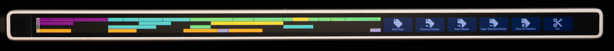
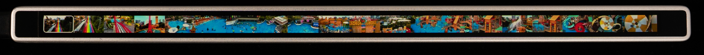

# Timeline

This document explains how to use Premiere Pro's timeline preview and control features on the Flexbar.

## In the FlexDesigner

You can find this feature under the "Adobe" category in the Key Library.

- **Application**: Currently supported only in Premiere Pro.
- **Mode**: Choose between Timeline Mode and Thumbnail Mode.
  - Thumbnail Mode requires rendering via Adobe Media Encoder, which may impact performance.

## On the Flexbar

- **Timeline Mode**: Allows you to preview and scrub through the timeline.

- **Thumbnail Mode**: Lets you preview each segment with a thumbnail. Scrubbing shows more precise previews.

