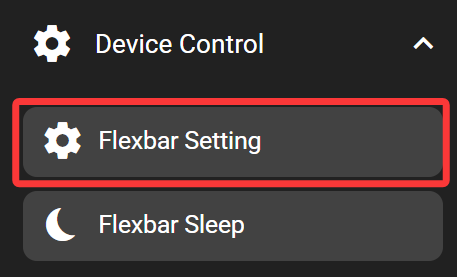
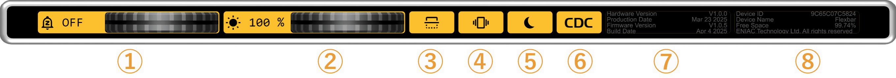

# Flexbar Setting

The Flexbar settings key opens the configuration page on the device. It allows controlling device options such as screen brightness, auto sleep, etc. The key needs to be added to the Flexbar first, then the settings can be accessed on the Flexbar.

## In the FlexDesigner

Other than the standard visual options, this key doesn't have any additional configurable functions in the FlexDesigner.

## On the Flexbar

Press the key to open the settings page. From left to right, it exposes the following settings:

1. Sleep Timeout: The device would enter sleep mode after given time of inactivity. Scroll all the way to the right (shorter amount of time) to disable this feature. We highly recommend enabling this feature to reduce burn-in on the OLED screen.
2. Screen Brightness: Set the brightness of the screen.
3. Rotate Screen: Rotate the display by 180 degrees. The home and back button assignment also follows this setting.
4. Haptic Switch: Enable or disable haptic (vibration) feedback. Supports completely turning off vibration, only disabling vibration for sliders and wheels, or enabling all vibration.
5. Auto Sleep: When this feature is enabled, the Flexbar would enter and exit sleep mode following your computer. Restarting the Flexbar is required for this setting to take effect.
6. Communication Protocol: Switch between CDC and HID USB device class. CDC is faster but exposes one additional serial port in your system. If you don't know what this means, CDC is recommended.
7. Device Information: Shows hardware version, manufacturing date, firmware version, and firmware build date.
8. Device Details: Displays device ID, device name, and remaining storage space on the device.

Additionally, scroll the page to the right to reveal the `ROLLBACK` button. This  allows you to roll back the firmware.

