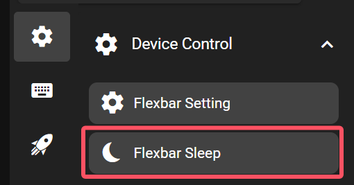

# Flexbar Sleep

The Flexbar sleep key allows putting the device into sleep mode manually. To put the computer to sleep, check out the 'Sleep' key in the 'Power Control' category.

Note that it's possible to set any page (other than the home page) or certain keys as screen saver (displayed after the device enters sleep mode), in the common tab. See 'Navigation' section for details.

## In the FlexDesigner

Other than the standard visual options, this key doesn't have any additional configurable functions in the FlexDesigner.

## On the Flexbar

Press the key to put the device into sleep mode.
