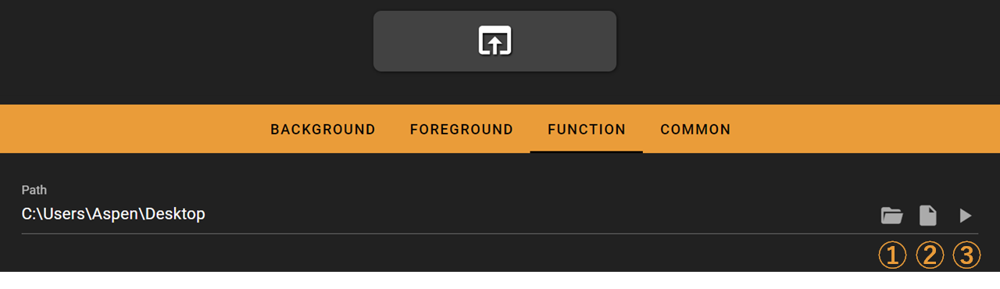

# Open Application

The open application key opens a user defined application or folder when pressed.

## In the FlexDesigner

The application or folder to open can be defined in the function tab in the FlexDesigner. There are 3 buttons to the right of the path input box. The first allows selecting a folder, while the second allows selecting an application to launch. The third button allows doing a test run directly on the computer before uploading the new profile to the Flexbar. The test run should perform the same operation as if the key is pressed on the Flexbar.

1. Select a path to open, which will be opened with File Explorer on Windows, Finder on MacOS, and the default file manager on Linux
2. Select a file or application to open
3. Test run on your computer

## On the Flexbar

Press the key to launch the defined application or folder in the FlexDesigner.
