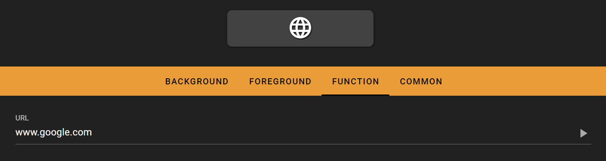

# Open Webpage

The open webpage key opens a user defined webpage using the default browser when pressed.

## In the FlexDesigner

The webpage to open can be defined in the function tab in the FlexDesigner. Enter the URL of the desired webpage (such as https://www.eniacelec.com) in the input box, and apply changes. There is a test run button to the right of the input box. It allows doing a test run directly on the computer before uploading the new profile to the Flexbar. The test run should perform the same operation as if the key is pressed on the Flexbar.

TIPS: To open the webpage in a specific web browser other than the system default one, consider using the Scripts feature.

## On the Flexbar

Press the key to open the defined webpage in the FlexDesigner.
