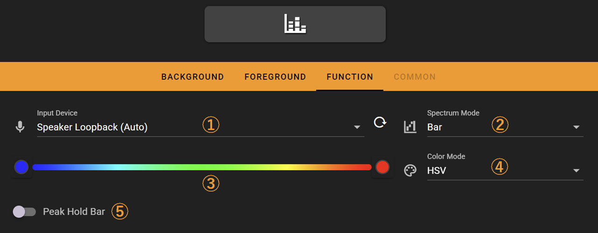
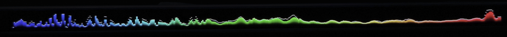
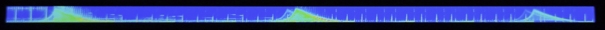

# Audio Spectrum

The audio spectrum key displays the real-time audio spectrum on the Flexbar.

## In the FlexDesigner

There are 5 settings for this key, available in the function tab in the FlexDesigner:

1. Input Device: Select the audio source for the audio spectrum key. Select loop back for visualization of the current playing audio on the host computer.
2. Spectrum Mode: Select between the available visual styles of the spectrum display.
3. Color: Select the color for the spectrum display.
4. Color Mode: The interpolation method for gradient colors, supporting both HSV and RGB modes.
5. Peak Hold Bar: Show a running peak bar for the spectrum.

For macOS users: Currently it only supports microphone input. To display spectrum of the audio on your Mac, it's currently required to use third-party software (such as blackhole) to create virtual device for audio loop back. Check documentations of relavent third-party software for installation guides.

## On the Flexbar

The spectrum would be displayed in the area allocated for this feature. This is no interactive actions for this key.

- Bar Mode

- Waterfall Mode

