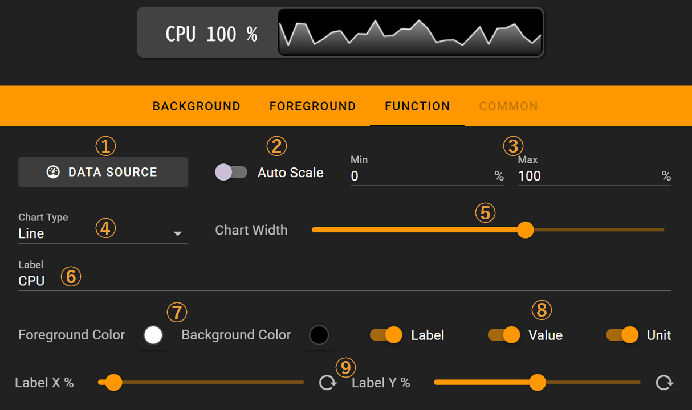

# Performance Chart

The performance chart key shows computer performance data charts.

The monitoring feature is built into the FlexDesigner. Optionally it also supports AIDA64 as a data source. The chart can be displayed as line chart, series bar, progress bar, progress circle, or simply hidden (text label only).

## Windows Setup

On Windows, you need to configure the data source for Performance Chart in advance. You can find the relevant settings in `Setting->Application`:

- Built-in Source: The software's built-in hardware data source. Administrator privileges are required to enable this monitoring.
- AIDA64: Obtain data from AIDA64

  > You need to enable `Writing sensor values to Registry` in AIDA64's `Preferences->External Applications`
  >

  

## In the FlexDesigner

There are various options in the FlexDesigner for this key.

1. Data Source Selection: Choose the source of performance data that interests you
2. Auto-scaling: When enabled, the chart will automatically adjust so that the minimum value in the current window becomes the chart's lowest point and the maximum value becomes the highest point. This is ideal for monitoring data trends
3. Manual Scaling: If auto-scaling is disabled, you can set custom minimum and maximum values for the chart. This is better for monitoring resource usage
4. Chart Type: Options include line chart, series bar chart, progress bar, progress circle, and text label
5. Chart Width Ratio: Controls how much space the chart occupies
6. Custom Data Name: Enter any name for your data, such as CPU, GPU, etc. *Note: Special symbols are not supported*
7. Chart Colors: Set the foreground and background colors for the chart
8. Label Options: From left to right, toggle whether to display the custom name (entered in step 6), the data value, and the data unit
9. Label Position: Controls for adjusting the horizontal and vertical position of the label

Label and chart and be enabled and disabled independently. To disable the label display, switch off the checkbox named 'Label'. To disable the chart, set the chart type to 'Label' in the list box named 'Chart Type'.

The auto-scale feature always scales the highest value in the chart to the maximum. This might be confusing as the chart could be a bit busy while the actual number is low. To avoid this, disable the auto-scale feature.

As the chart would be displayed in the allocated area, it's recommended to disable any foreground elements and keep background clear for this key.

## On the Flexbar

The selected chart would be displayed in the area allocated for this feature. This is no interactive actions for this key.

