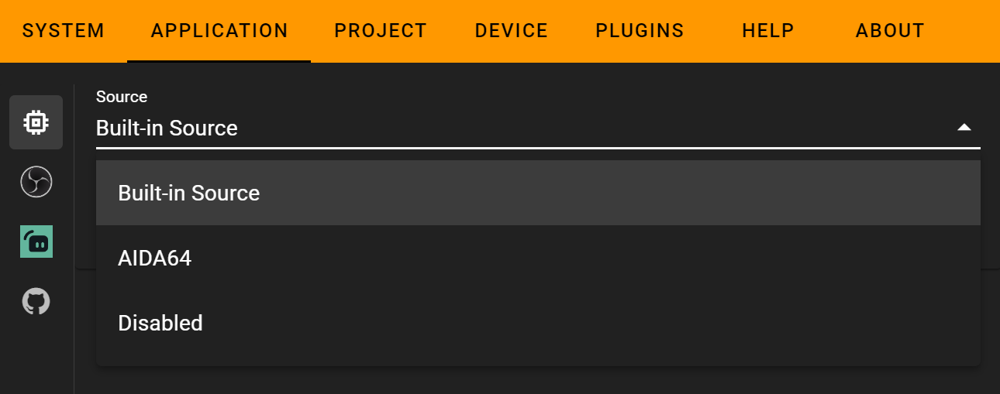
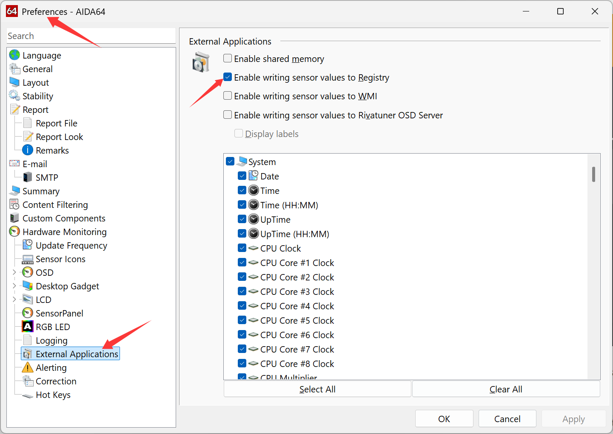
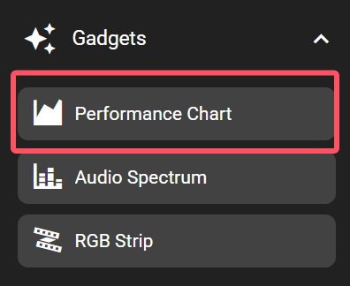
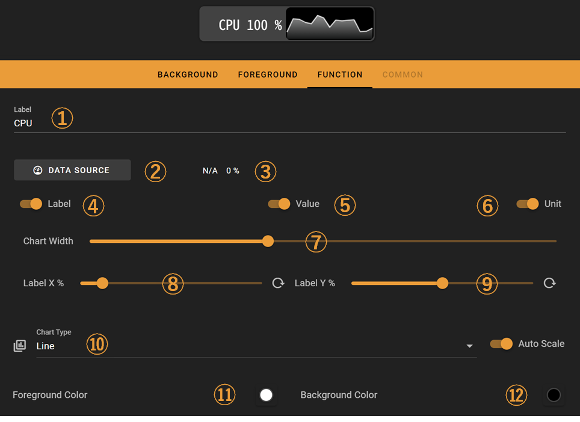

# Performance Chart

The performance chart key shows computer performance data charts.

The monitoring feature is built into the FlexDesigner. Optionally it also supports AIDA64 as a data source. The chart can be displayed as line chart, series bar, progress bar, progress circle, or simply hidden (text label only).

## Windows Setup

On Windows, you need to configure the data source for Performance Chart in advance. You can find the relevant settings in `Setting->Application`:

- Built-in Source: The software's built-in hardware data source. Administrator privileges are required to enable this monitoring.
- AIDA64: Obtain data from AIDA64

  > You need to enable `Writing sensor values to Registry` in AIDA64's `Preferences->External Applications`
  >

  

## In the FlexDesigner

There are various options in the FlexDesigner for this key.

1. 自定义数据名称，可以自定义显示数据的名称，如CPU，GPU等
2. 数据源选择，性能图表的数据来源，请选择自己感兴趣的数据源
3. 数据源预览，显示选定数据的值和单位
4. 标签是否显示自定义名（1中输入的值）
5. 标签是否显示数据值
6. 标签是否显示单位
7. 图标宽度占比
8. 标签的水平位置
9. 标签的垂直位置
10. 图表类型，支持折线图，系列条形图，条形图，环形图和文本标签
11. 

Label and chart and be enabled and disabled independently. To disable the label display, switch off the checkbox named 'Label'. To disable the chart, set the chart type to 'Label' in the list box named 'Chart Type'.

The auto-scale feature always scales the highest value in the chart to the maximum. This might be confusing as the chart could be a bit busy while the actual number is low. To avoid this, disable the auto-scale feature.

As the chart would be displayed in the allocated area, it's recommended to disable any foreground elements and keep background clear for this key.

## On the Flexbar

The selected chart would be displayed in the area allocated for this feature. This is no interactive actions for this key.
