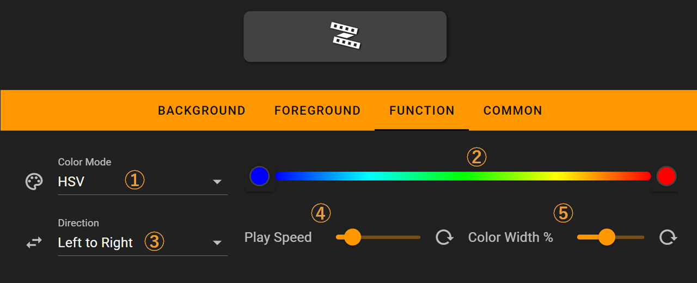

# RGB Strip

The RGB strip feature displays a full-screen dynamic RGB rainbow strip on the Flexbar.

## In the FlexDesigner

The FlexDesigner exposes several settings of the RGB strip in the function page:

1. Color Mode: The interpolation method for gradient colors, supporting both HSV and RGB modes
2. Set the start and end color of the RGB strip. The color mode would affect how colors are interpolated between the two.
3. Direction: Set the direction of animation
4. Play Speed: Set the speed of animation
5. Color Width: Set the width/ length before the colors repeat

Note: This is just an entrance to the RGB strip screen. So you can customize its appearance (background and foreground) to your own like.

## On the Flexbar

Press the key on the Flexbar to enter the RGB strip screen. Press either the back or home key to exit.
