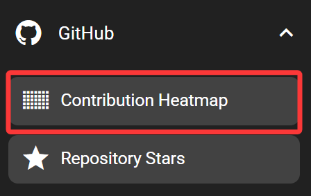
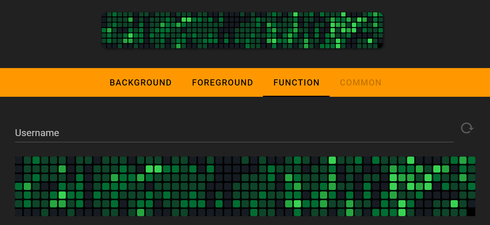

# Heatmap

The heatmap feature displays contribution heatmap of a specific GitHub user.

## In the FlexDesigner

To use this feature, the GitHub username needs to be configured in the FlexDesigner. Additionally, the heatmap can be manually refreshed by clicking the refresh button right next to the username input box.

## On the Flexbar

The heatmap would be displayed in the area allocated for this feature. This is no interactive actions for this key.

