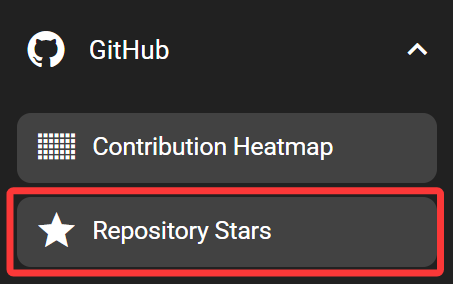
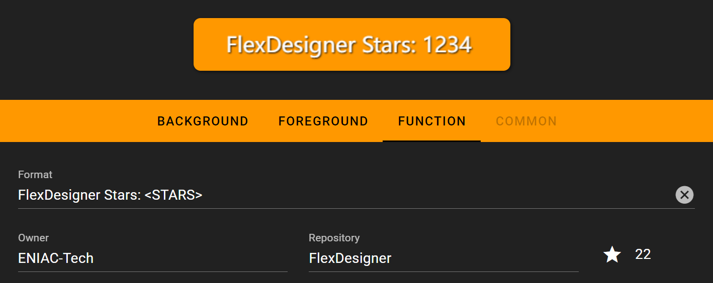

# Stars

The stars feature displays stars of a specific repository.

## In the FlexDesigner

The FlexDesigner exposes the following settings in the key tab:

- Format: Set the format of the string. The text '`<STARS>`' would be replaced by the number of stars. If '`<STARS>`' is not present in the format string, it would be appended to the end of the string.
- Owner/ Repository: Set the source repository to display the data for.

Additionally, you can click on the star icon to manually refresh the data.

## On the Flexbar

The star count would be displayed in the area allocated for this feature. This is no interactive actions for this key.

