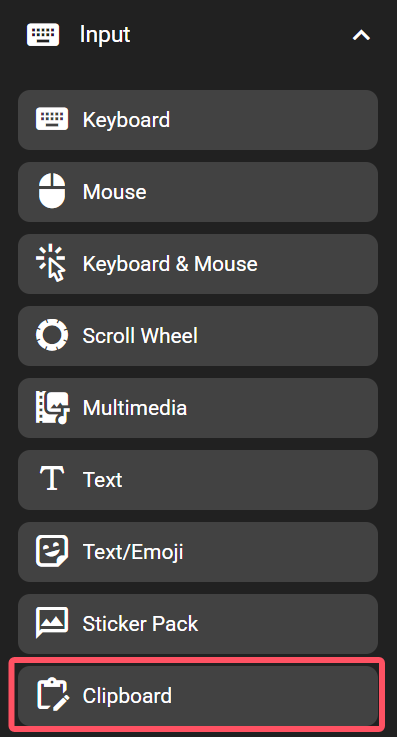
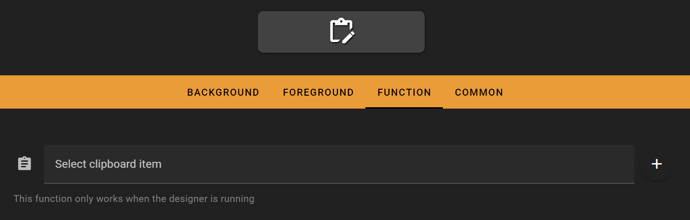
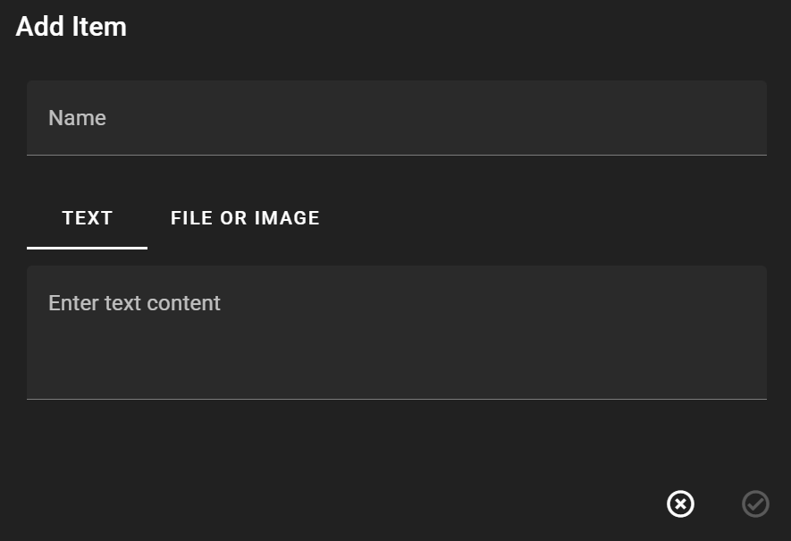

# Clipboard

The clipboard feature allows you to quickly copy a file, image, or text to your clipboard with a single click, making it easy to paste anywhere you need.

## In the FlexDesigner

To get started, click the + icon on the right to create a new clipboard item.

- Name: Give your clipboard item a name for easy identification later
- Text: Enter text content to be copied to the clipboard
- File or Image: Select a file or image to be copied to the clipboard

Once created, simply select your clipboard item to complete the setup.

## On the Flexbar

Just press the corresponding button, and Flexbar will automatically copy your content to the clipboard and paste it.
