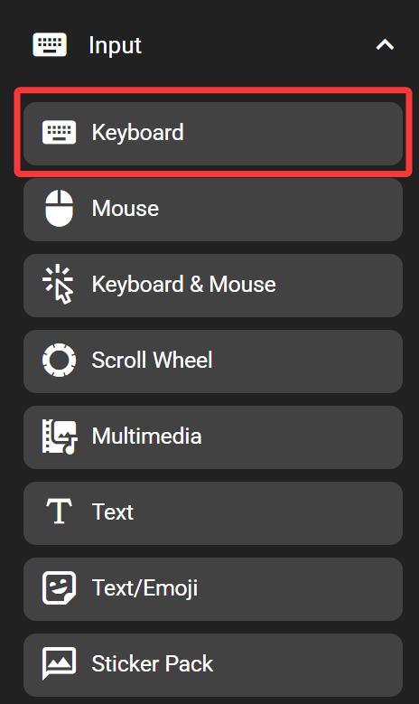
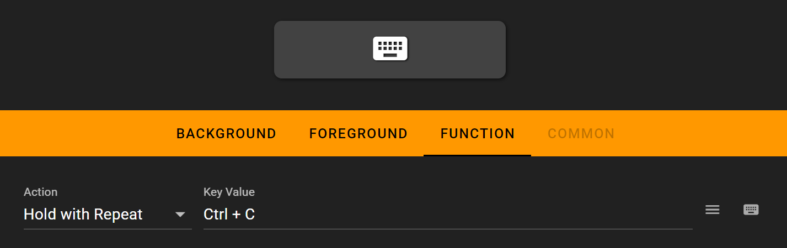
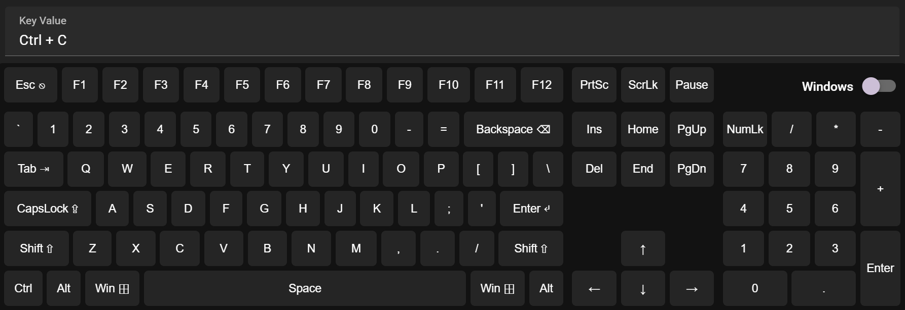
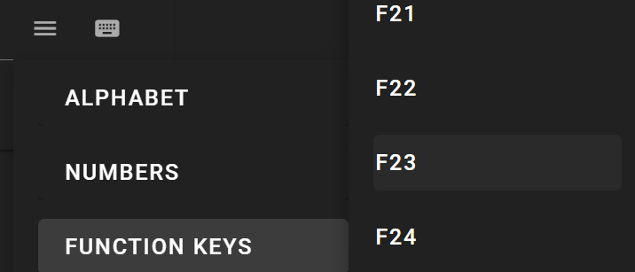

# Keyboard

The keyboard key sends key presses as if they are pressed on a physical keyboard.

This feature emulates a standard USB keyboard. It works on any devices without having FlexDesigner running.

## In the FlexDesigner

The FlexDesigner exposes the following settings for this key:

- Execution Type: Set if the key should be repeated or keep pressed. The following options are available:
  - Single Click: Trigger once when pressed.
  - Hold with Repeat: Trigger once when pressed, repeat if the key is kept pressed (similar to a real keyboard).
  - Always Hold: Press the key, and hold the key pressed even after the key has been released.
  - Release/ Release All: Release the key when pressed. If no key is assigned, release all previously pressed keys.
  - AB Mode: Press A key when pressed, and press B key when released.
- Key Value: Set the key or key combination to send. Click on the input box and press the key to set it. Alternatively, use the menu button on the right to select key from the menu, or use the virtual keyboard button to select one from the on-screen virtual keyboard. To clear the key combination, click on the input box to highlight it, and click on the X button to the right of the input box.
You can also use the virtual keyboard to input your keys

You can also directly select the keys you need to input

## On the Flexbar

Press the key on the Flexbar to trigger the defined action.
