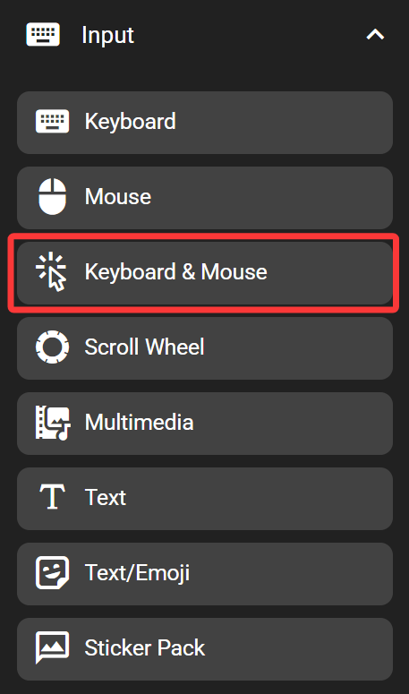
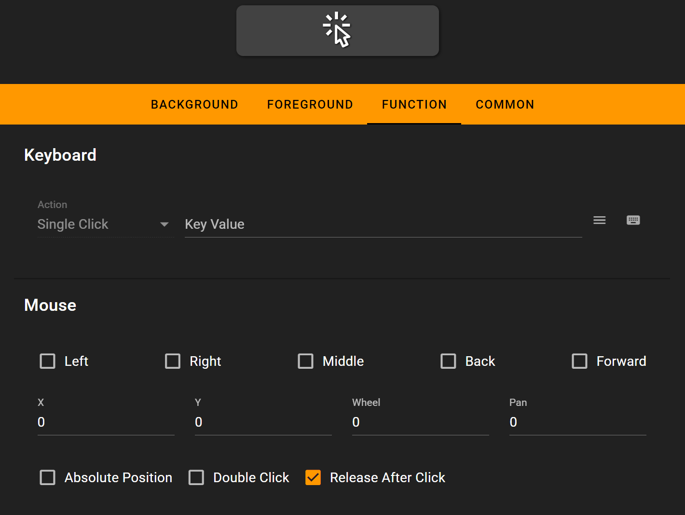

# Keyboard & Mouse

The keyboard & mouse key sends keys and mouse event with one click. One use case would be using it to implement shortcut like 'Ctrl + Click' or 'Ctrl + Scroll'.

This feature emulates a set of standard USB keyboard and mouse. It works on any devices without having FlexDesigner running.

## In the FlexDesigner

This key provides the same set of settings as the keyboard key and the mouse key. Check [keyboard ](./keyboard.md)and [mouse ](mouse.md)pages for details.

> The keyboard mode in this key only supports single click

## On the Flexbar

Press the key on the Flexbar to trigger the defined action.
