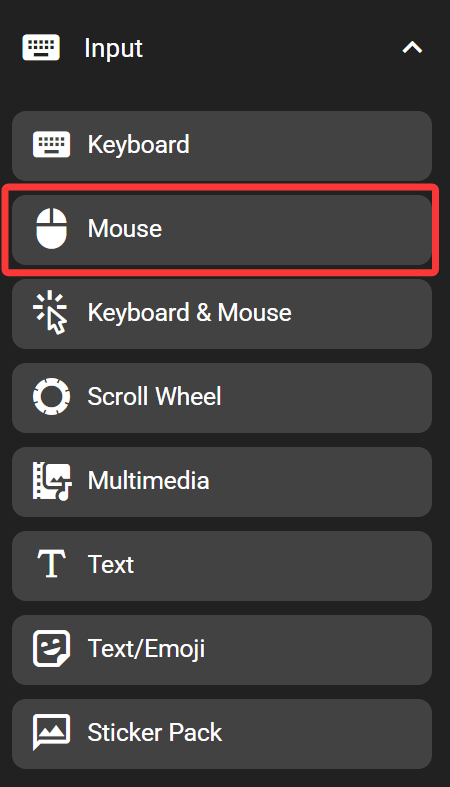

# Mouse

The mouse key sends mouse actions as if on an actual mouse.

This feature emulates a standard USB mouse. It works on any devices without having FlexDesigner running.

## In the FlexDesigner

The FlexDesigner exposes the following settings for this key:

- Buttons: Includes the 'Left', 'Right', 'Middle', 'Back', and 'Forward' checkboxes. These specify if any of those buttons should be pressed in the mouse event.
- Movement: Specify how much the mouse should move when triggered. The 'wheel' and 'pan' specifies the movement of the vertical scroll wheel and the horizontal scroll wheel respectively.
- Absolute Position: When checked, the movement would be sent as absolute movement instead of relative. Which means the mouse would be moved to the specified location, instead of move by the specified distance.
- Double Click: Check if the click needs to be a double click
- Release After Click: Check if the mouse buttons should be released after click. Otherwise, the mouse button would be in the pressed state

## On the Flexbar

Press the key on the Flexbar to trigger the defined action.
