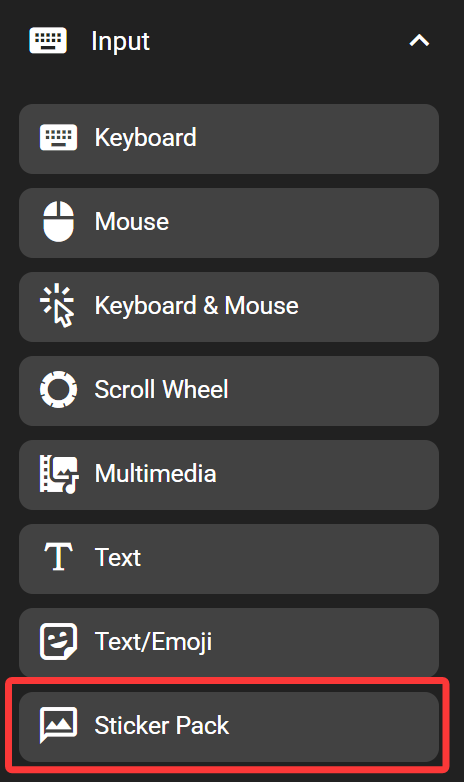

# Sticker Pack

The sticker pack key inserts a sticker (like meme, or any image) to the active input box from the sticker pack when pressed.

## In the FlexDesigner

The stickers are organized in sticker packs. The sticker pack is a library of all the stickers that can be used in the FlexDesigner, meaning the sticker pack configured for a single key is shared across all sticker pack keys. The software provides some basic functions for organizing the sticker pack (in the order of buttons in the software):

- Import sticker pack: Import a previously exported sticker pack from the FlexDesigner
- Add new image: Select an image file on your computer, then add it to the sticker pack
- Add from clipboard: Paste the previously copied image into the sticker pack
- Export sticker pack: Export the current sticker pack to a single file for backup or sharing

To remove image from the sticker pack, right-click on the image and click 'Delete'. To remove multiple images from the sticker pack, select the images by using the checkbox in the top right corner of the image when hovering the cursor over, right click on any image, click 'Delete all selected'.

Notably, these operations are the same for the icon pack used in foreground settings. However, it doesn't support managing multiple sticker packs unlike icon packs.

Each key can only have one sticker assigned to it. Single click the desired sticker from the sticker pack to pick one. It should show up in the preview area on the top of the sticker pack area.

## On the Flexbar

Press the key on the Flexbar to insert the defined sticker into the current active input box on the computer.

## TIPS

While the software supports multiple formats, the compatibility is also subject to the target software (such as when inserting into messaging software that doesn't support GIF at all, the Flexbar won't be able to magically insert the animated GIF there). For maximum compatibility it's recommended to only use JPEG and GIF format.
