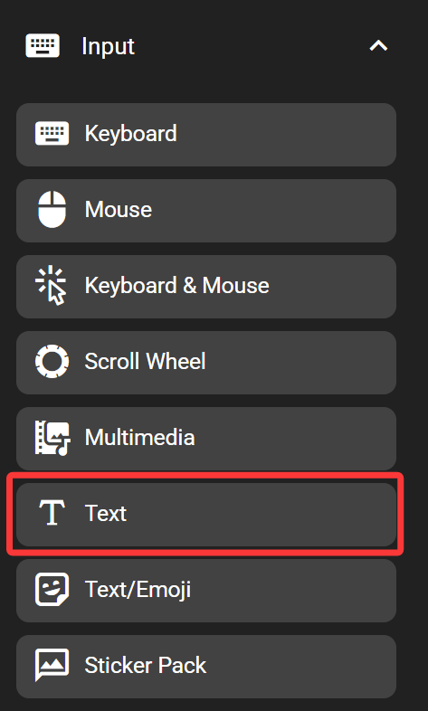
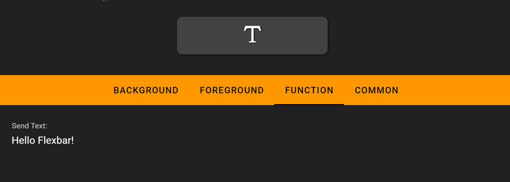

# Text

The text key inserts text to the active input box on the computer. This key emulates keys being pressed on a standard USB keyboard, so it could only support things that could be directly entered on the keyboard. If other characters are needed, consider using the text/ emoji key instead.

## In the FlexDesigner

The text can be defined in the function tab in the FlexDesigner. To enlarge the input box, drag the dashed triangle to the lower right of the input box.

## On the Flexbar

Press the key to insert the defined text to the active input box.
