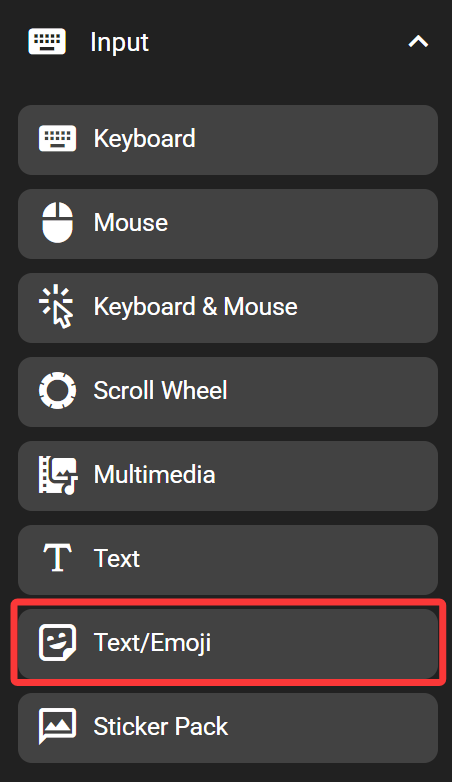
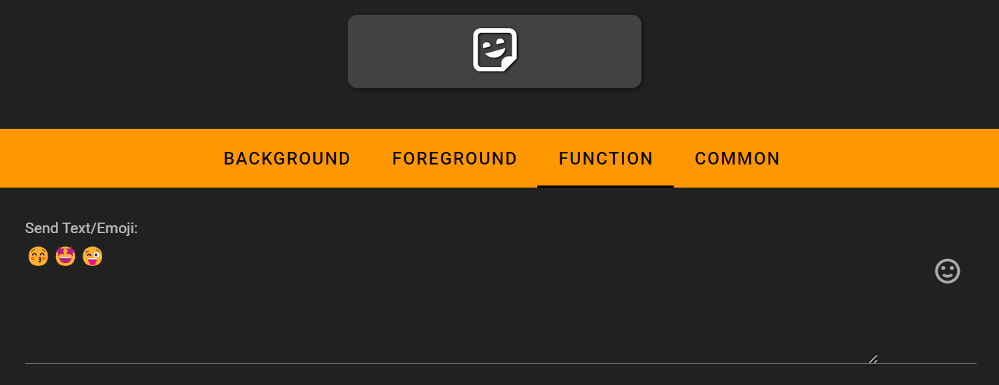

# Text/ Emoji

The text/ emoji key inserts text to the active input box on the computer. This key supports emoji, but requires the FlexDesigner to be running. Also see the text key which doesn't support emoji but also doesn't depend on the FlexDesigner.

## In the FlexDesigner

The text or emoji (or any combination of these in one or multiple lines) can be defined in the function tab in the FlexDesigner. Emoji can be inserted with third party input method/ panels (such as the emoji picker on the macOS), or using the emoji button to the right of the input box. To enlarge the input box, drag the dashed triangle to the lower right of the input box.

## On the Flexbar

Press the key to insert the defined text/ emoji to the active input box.
