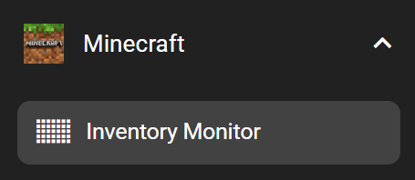
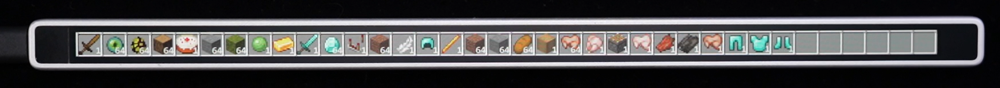

# Inventory Monitor

Inventory Monitor allows you to view and manage your Minecraft inventory directly from the Flexbar.

## Install FlexLink Mod

To use Inventory Monitor, you’ll need to install the [FlexLink Mod](../../../assets/flexlink-1.0.0.jar) into your Minecraft modpack.

> Currently, FlexLink Mod supports Forge version 1.20.1

## In the FlexDesigner

You can find this feature under the "Minecraft" category in the Key Library.

## On the Flexbar

You can view your entire inventory and click on any item to equip it in Steve’s hand.

> Fun fact: if you set the width of Inventory Monitor to **2170**, Flexbar will perfectly display the entire inventory without scrolling.

