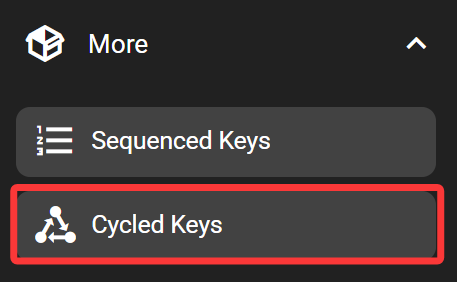
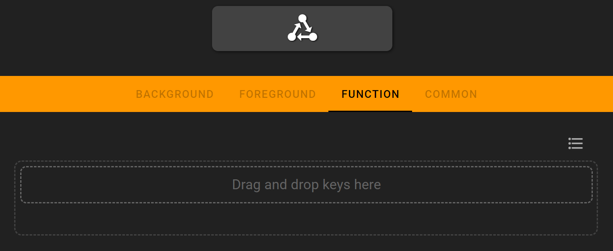

# Cycled Keys

The cycled-keys cycles between multiple keys when pressed. Only the currently displayed key would be executed. If you need executing multiple operations at once, check out the 'Sequenced Keys'.

## In the FlexDesigner

Because the cycled-keys is merely a container for other keys, it doesn't have the usual background and foreground settings. The only available tab is the function tab, where the list of keys to cycle through can be defined.

To define the keys, drag and drop desired key from the right pane into the middle area. Note that when in the function tab, only keys that can be used with the cycle key would be displayed. **You can double-click a key to further edit its specific functions.**

By default, keys are cycled through in order. It's also possible to switch to random order by clicking on the ordering button top right to the action list.

For each added key, the appearance can be customized individually. Highlight the desired key by clicking it, then switch to the foreground and background tab to customize it. The function tab of added keys can be opened by double-clicking on the key.

The most typical application of Cycled Keys is to control media play and pause. You can drag two media keys from the right side into the Cycled Keys list, and set the corresponding icons and colors

## On the Flexbar

Press the key to execute the currently displayed key. Once done, the next key would be displayed on the key.
