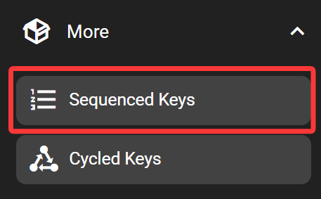
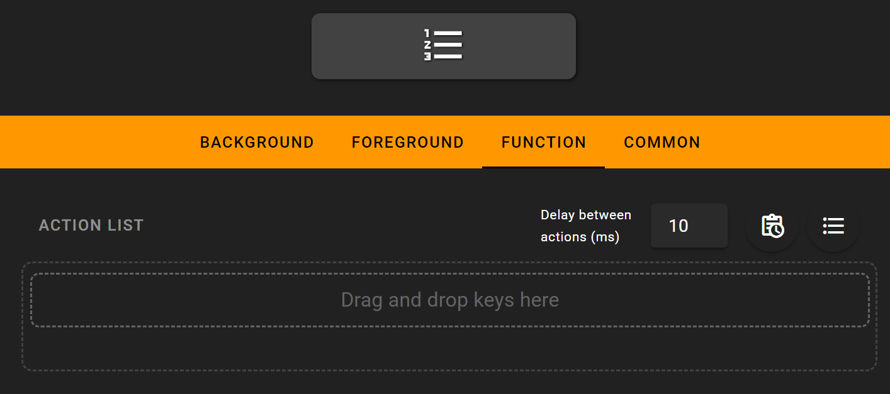

# Sequenced Keys

The sequenced-keys executes multiple keys when pressed, as if multiple keys are pressed sequentially. If only one key out of a list shall be executed at once, check out the 'cycled keys'.

## In the FlexDesigner

The list of keys to be executed can be defined in the function page.

To define the keys, drag and drop desired key from the right pane into the middle area. Note that when in the function tab, only keys that can be used with cycle buttons would be displayed.

Right top to the action list, there are several settings controlling its behavior:

- Delay between actions: The actions are executed sequentially. After each action, the software waits for a certain amount of time (subject to influence of computer performance and other factors).
- Add to schedule: The list of actions can be trigger according to schedule. Use this button to define the schedule (such as 9AM every Monday), then this sequence would be automatically executed according to the schedule. Use the delete button in the schedule page to cancel the schedule.
- Ordering: By default, keys are executed in order (sequentially). It's also possible to switch to random order by clicking on the ordering button top right to the action list.

In the sequenced keys, there are two additional flow control 'key's in the 'more' category available (in the right key library pane):

- Delay: Delay the execution of the next action by defined amount of time. The time is added on top of the global delay settings.
- Repeat: Repeat the execution of actions within the repeat group by defined amount of times. The number of iterations and be defined at the input box right top to the repeat group. Repeat group can be nested as well.

The function tab of added keys can be opened by double-clicking on the key.

## On the Flexbar

Press the button to execute the currently displayed key. Once done, the next key would be displayed on the button.
