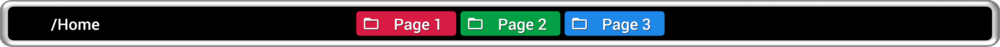
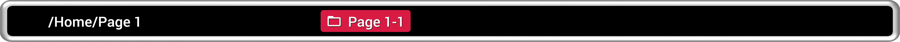
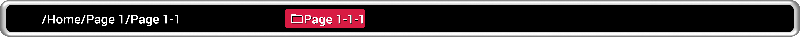
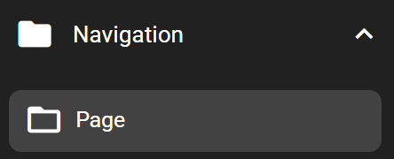
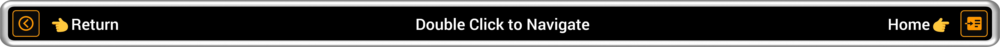
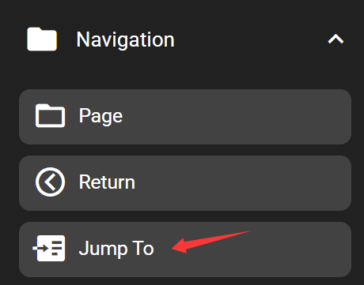

# Flexbar Page Structure and How to Navigate on Flexbar

## Tree-Structured Folder Pages

Flexbar uses a tree like Pages (folder) structure to contain and manage all keys. When you power up Flexbar, it starts on the default "Home" page. On any page, you can add keys or drag in a sub-page called "Pages." You can even add more nested "Page" inside another "Page." This is similar to managing folders on a computer, giving you the freedom to create, categorize, store, and quickly switch between different sets of shortcuts. For details on how to navigate between pages, please read on.

···

## How to Add

In the Key Library on the right, under the Navigation category, you can find the "Page" key and drag it onto the virtual Flexbar.

> Nested sub-pages support up to 15 levels in total (counting from "Home").
>
> You can rename Pages or have their appearance customized just like any other key ("Home" cannot be renamed, as it is not a key).
>
> In the Flexbar Designer, the current page path "home/page" is displayed on top of the virtual Flexbar.
>
> In the Flexbar Designer, if a Page is empty, nothing will be displayed on the virtual Flexbar. However, on the real Flexbar device, "⚠️Empty Page" will be displayed.

## How to Navigate on Flexbar

Flexbar has two side touch pads (which are non-display areas) and are set as navigation keys by default.

By default, the left touch pad is the "Return" key which takes you back to the previous Page. The right side is set to the "Jump To" key which takes you directly back to the "Home" page.

## Navigating on the Virtual Flexbar in Flexbar Designer

Double-click a Page or navigation key to enter/return/jump.
Single-click opens the configuration for that Page/Key, same as all other keys.

## Navigating on the Real Flexbar

Single-click any Page or navigation key to enter/return/jump.

## How to Add

You can find "Return" and "Jump To" keys in the Key Library under the Navigation category on the right. Simply drag them onto the virtual Flexbar.

> "Jump To" can jump to any path in Flexbar. Set it under the "Function" tab in its configuration.
>
> The side touch pads can be assigned different functions. When you open the drawer, place a key closest to the touch pad to have the touch pad perform that key’s function. For more details, see the "Touch Pad and Drawer" chapter.
>
> When you flip the Flexbar screen in "Flexbar Setting", the touch pads’ functions also flip accordingly.
