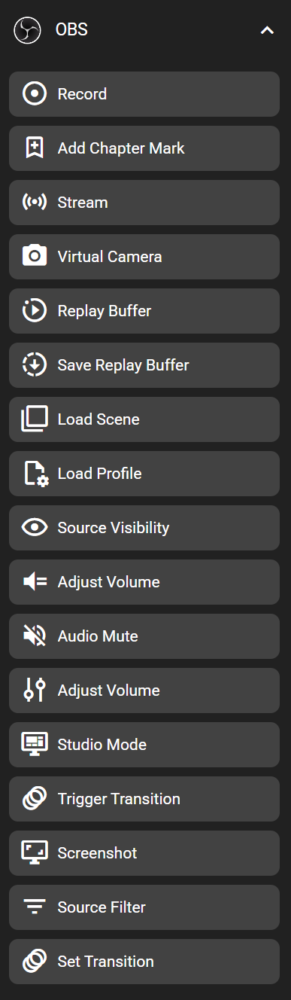

# OBS Studio

You can control OBS Studio quickly and easily using the Flexbar.

## Set Up Your OBS Studio

To get started, enable OBS Studio's WebSocket service via **Settings > Application > OBS**.

1. Open the WebSocket settings panel  
2. Click **Show Connect Info**  
3. Copy the **IP**, **Port**, and **Password**

Paste the IP, Port, and Password into the corresponding input fields, then click **Test Server**. You should see a “Connected” status if everything is set correctly.

## In the FlexDesigner

You can find this feature under the "OBS" category in the Key Library.

## On the Flexbar

