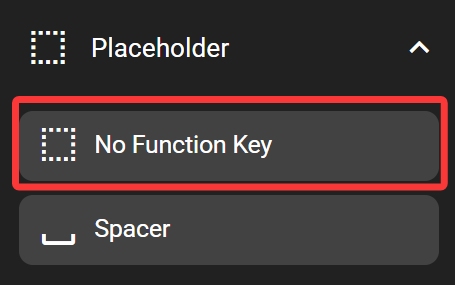

# No Function Key

The no-function-key is a key that has no function, only for static displays.

## In the FlexDesigner

Background and foreground settings are available for this just like for a normal key. The function page is blank becuase it has no function.

## On the Flexbar

The no-function-key is displayed just like any other keys, but it cannot be pressed.
