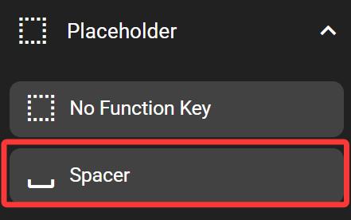
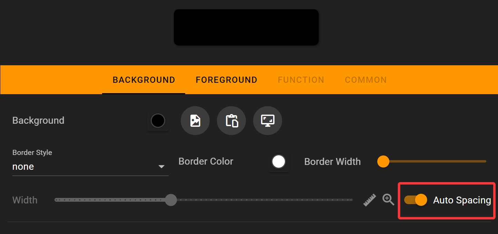

# Spacer

The spacer takes blank space between keys.

## In the FlexDesigner

The spacer has background and foreground settings as well. By default, it's blank, with colors all set to black. But you can still customize it if you wish. Compared to the no-function-key, it additionally has an auto spacing feature in the function tab. It would automatically use up the remaining space in the page.

## On the Flexbar

The spacer is displayed on the Flexbar, occupying space just like other keys. But it cannot be pressed.
