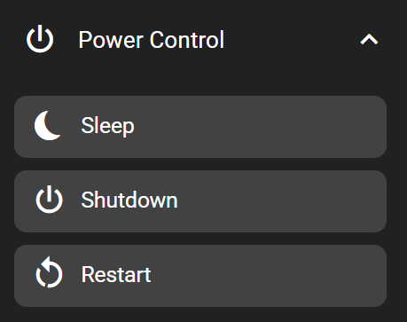

# Power Control

Power control keys are used to control your computer's power state.

## Sleep

This key puts the computer to sleep when pressed.

This key only works when the FlexDesigner is running. If this is not desired, consider using the 'Multimedia' key in the 'Input' category and set the function to 'Power Control' → 'Sleep'. The multimedia key works without the FlexDesigner, but the exact handling would be subject to the operating system settings.

To put the Flexbar to sleep, check out the 'Flexbar Sleep' key in the 'Device Control' category.

## Shutdown

This key shuts down your computer when pressed.

> Please note that due to permission restrictions, this function is not available on MacOS and Linux.
>
> Be aware that pressing this key will shut down your computer immediately. It's recommended to use this with the long-press function from the Common Tab.

## Restart

This key restarts your computer when pressed.

> Please note that due to permission restrictions, this function is not available on MacOS and Linux.
>
> Be aware that pressing this key will restart your computer immediately. It's recommended to use this with the long-press function from the Common Tab.
