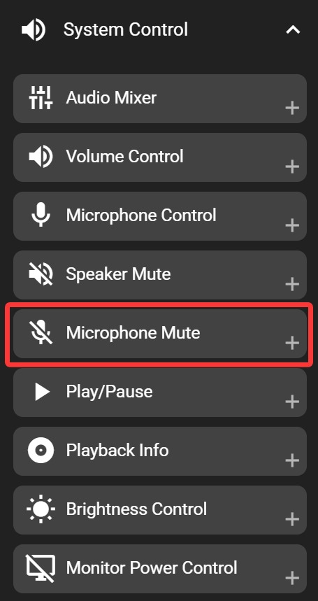

# Microphone Mute

The microphone mute key allows you to quickly toggle your system's microphone on or off. When you press this key, your computer's microphone will switch between muted and unmuted.

This function only operates when FlexDesigner is running. If you need microphone mute control without FlexDesigner, you may consider using your system's built-in multimedia mute key. Please note that these methods may not always stay synchronized with the Flexbar indicator.

## In the FlexDesigner

Apart from appearance customization options, this key does not have any other settings in FlexDesigner.

## On the Flexbar

Tap the microphone mute key on the Flexbar to toggle the microphone mute state. If the microphone mute status changes by other means (such as keyboard shortcuts or system tray), the Flexbar key will update to show the correct mute state.
