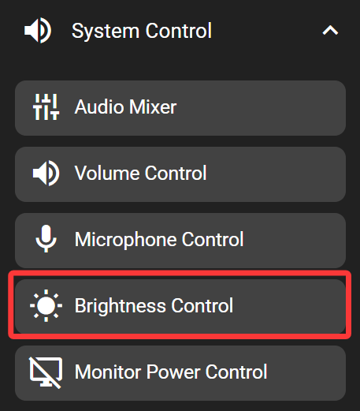
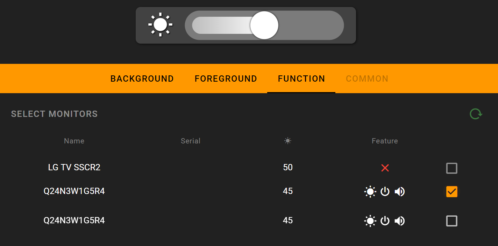

# Monitor Brightness Control

This key allows changing external monitor brightness using the DDC/CI protocol. Most of the monitors supports this protocol to some degree. This key also allows controlling multiple monitors simultaneously. This key only works when the FlexDesigner is running.

Note that on a laptop, it would be easier to use the 'Multimedia' key in the 'Input' category to control screen brightness.

## In the FlexDesigner

A list of connected monitors would show up in the function tab of this key. It also shows the control supported by the monitor. Of each monitor, there is a checkbox to the right. Only checked monitors would be controlled by this key.

## On the Flexbar

The key shows up as a brightness slider, similar to a volume slider. Drag on the slider to change the brightness of selected monitor.
