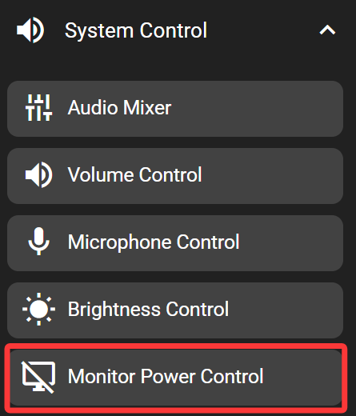
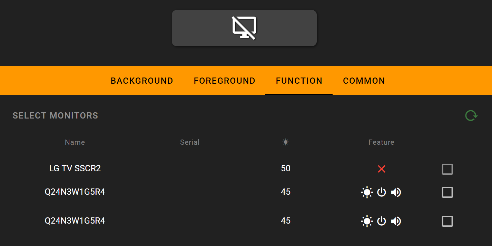

# Monitor Power Control

This key allows turning off external monitors using the DDC/CI protocol. Most of the monitors supports this protocol to some degree. This key also allows controlling multiple monitors simultaneously. Note that this key won't be able to turn the monitor back on, as the connection to the monitor is lost after it has been turned off. This key only works when the FlexDesigner is running.

## In the FlexDesigner

A list of connected monitors would show up in the function tab of this key. It also shows the control supported by the monitor. Of each monitor, there is a checkbox to the right. Only checked monitors would be controlled by this key.

## On the Flexbar

Press the key to turn off the selected monitor.
