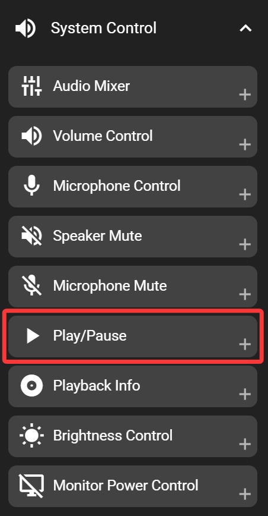

# Play/Pause

**Windows only**

The play/pause key allows you to quickly toggle media playback on your system. When you press this key, it will send a play/pause command to your currently active media application (such as music or video players), switching between playback and pause states.

This function only operates when FlexDesigner is running. If you need play/pause functionality without FlexDesigner, you may use your system's built-in media keys, but those may not always stay synchronized with the Flexbar indicator.

## In the FlexDesigner

Apart from standard appearance customization options, this key does not have any additional settings in FlexDesigner.

## On the Flexbar

Tap the play/pause key on the Flexbar to control playback in your media application. If playback is paused or resumed by other means (such as keyboard shortcuts or clicking in the media player), the Flexbar key will update to show the correct play/pause state.

> You can freely customize the appearance of the play and pause states.
