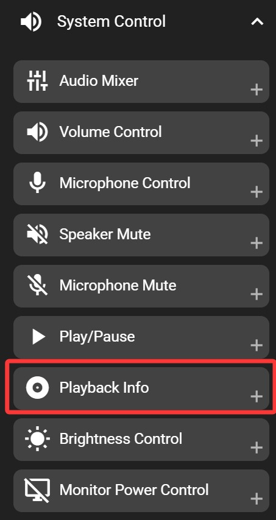
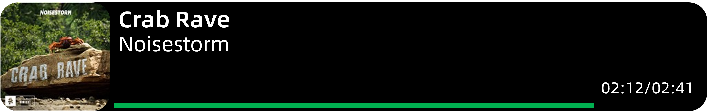

# Playback Info

**Windows only**

Displays the playback status of your current media, including cover art, playback progress, title, and artist. The displayed information is synchronized with Windows media info.

## In the FlexDesigner

Apart from standard appearance customization options, this key does not have any additional settings in FlexDesigner.

## On the Flexbar

Tap the play/pause key on the Flexbar to control playback in your media application. If playback is paused or resumed by other means (such as keyboard shortcuts or clicking in the media player), the Flexbar key will update to show the correct play/pause state.

> You can freely customize the appearance of the play and pause states.
