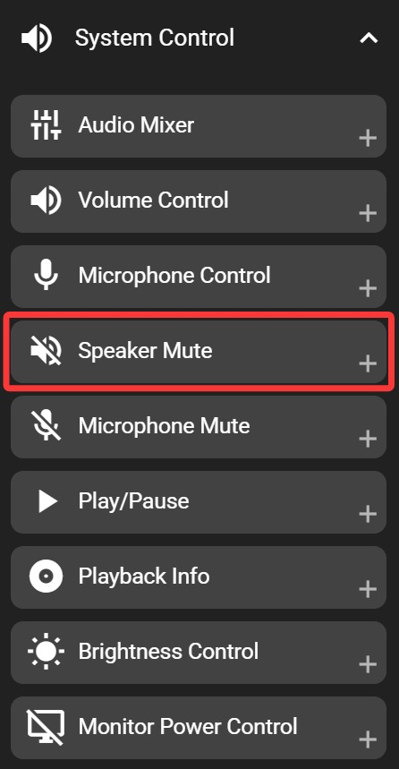

# Speaker Mute

The speaker mute key allows you to quickly toggle your system's audio output between muted and unmuted. When you press this key, your computer's speakers will switch between outputting sound and being silent.

This function operates only when FlexDesigner is running. If you need speaker mute functionality without FlexDesigner, you may consider using your system's built-in multimedia mute key. But these may not always stay synchronized with the Flexbar indicator.

## In the FlexDesigner

Apart from standard appearance customization options, this key has no additional settings in FlexDesigner.

## On the Flexbar

Tap the speaker mute key on the Flexbar to toggle the speaker mute state. If the system speaker mute status changes through other means (such as keyboard shortcuts or the system panel), the Flexbar key will update to reflect the current mute status.
