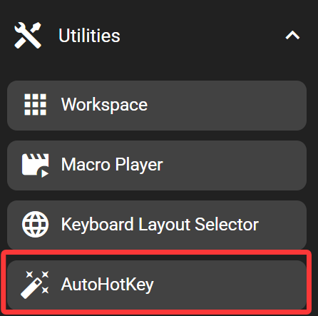
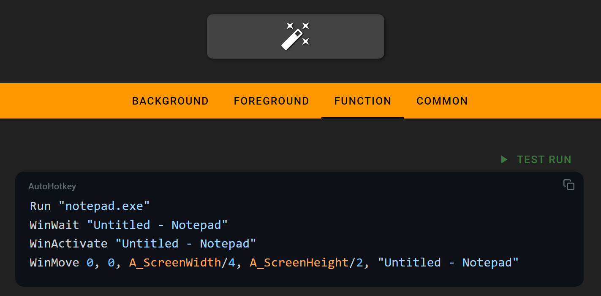

# Auto Hot Key

This function allows you to execute an [Auto Hot Key](https://www.autohotkey.com/) V2 script with a single click.

[Auto Hot Key](https://www.autohotkey.com/) is a powerful Windows utility that can control your mouse, keyboard, applications, system media, and more.

## In the FlexDesigner

The Function Tab provides a simple code editor where you can edit your AHK script.

A test run button is available in the top-right corner of the editor for quickly testing if your script works properly.

## On the Flexbar

Clicking this key will immediately run the AHK script you've entered.
