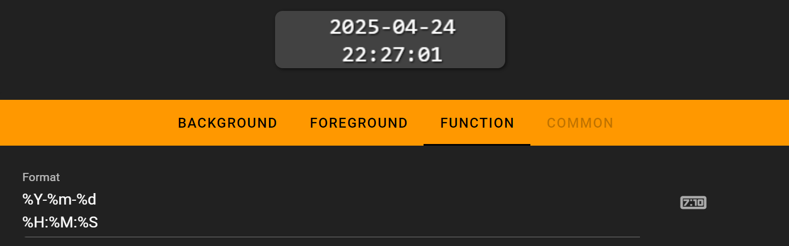
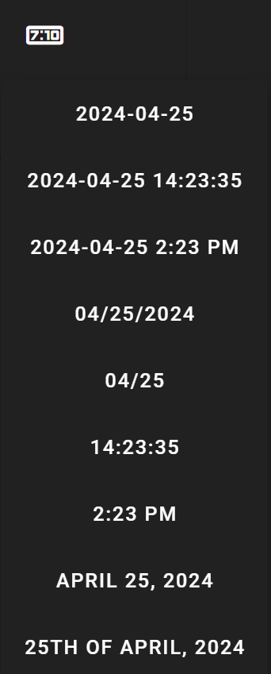
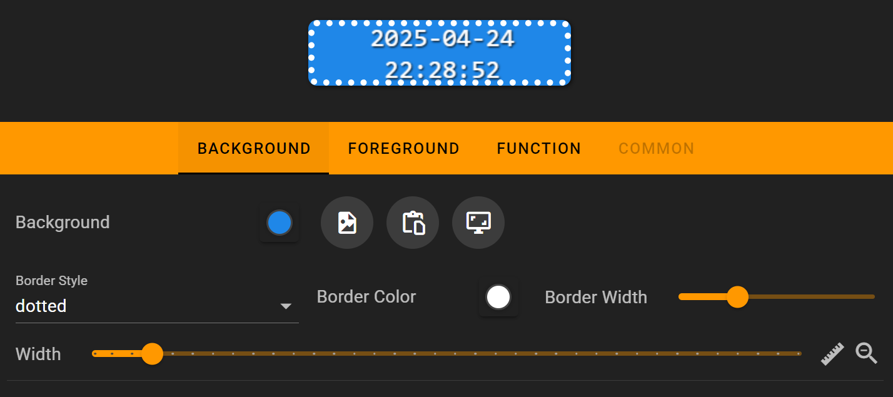

# Clock

Display a real-time clock on your Flexbar

## In the FlexDesigner

You can customize the time display format using standard time format codes. We use the %X symbol to control how the clock appears, with the following supported format codes:

> To display a % symbol, use %%

| Format | Description                                                            |
| ------ | ---------------------------------------------------------------------- |
| %a     | Abbreviated weekday name                                               |
| %A     | Full weekday name                                                      |
| %b     | Abbreviated month name                                                 |
| %B     | Full month name                                                        |
| %c     | Date and time representation                                           |
| %d     | Day of the month (01-31)                                               |
| %H     | Hour in 24h format (00-23)                                             |
| %I     | Hour in 12h format (01-12)                                             |
| %j     | Day of the year (001-366)                                              |
| %m     | Month as a decimal number (01-12)                                      |
| %M     | Minute (00-59)                                                         |
| %p     | AM or PM designation                                                   |
| %S     | Second (00-59)                                                         |
| %U     | Week number with the first Sunday as the first day of week one (00-53) |
| %w     | Weekday as a decimal number with Sunday as 0 (0-6)                     |
| %W     | Week number with the first Monday as the first day of week one (00-53) |
| %x     | Date representation                                                    |
| %X     | Time representation                                                    |
| %y     | Year, last two digits (00-99)                                          |
| %Y     | Year                                                                   |
| %Z     | Timezone name or abbreviation                                          |
| %%     | A % sign                                                               |

You can also select from preset time formats in the dropdown panel.

The clock supports custom fonts and background settings, but we don't recommend using images as backgrounds as this can increase loading time.

## On the Flexbar

