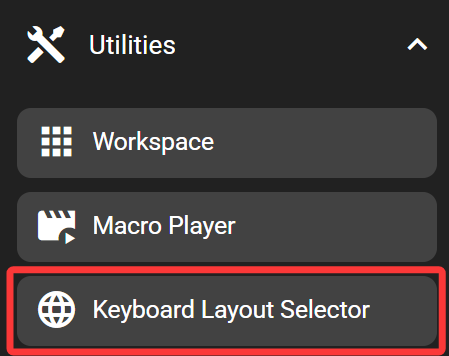
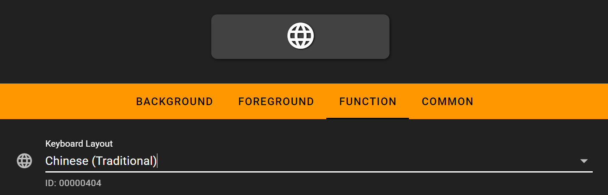

# Keyboard Layout Selector

The keyboard layout selector key allows switch to pre-defined keyboard layout/ input method when pressed. This is especially useful when there are multiple keyboard layouts enabled on the computer.

This key only works when the FlexDesigner is running. It is also only present in the Windows version of the FlexDesigner at the moment.

## In the FlexDesigner

The desired keyboard layout/ input method can be defined in the FlexDesigner.

## On the Flexbar

Press the key to switch to the defined keyboard layout.
