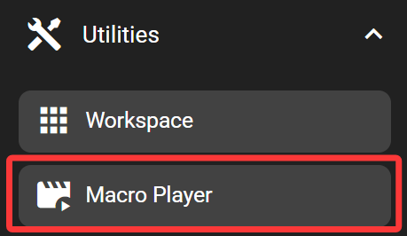
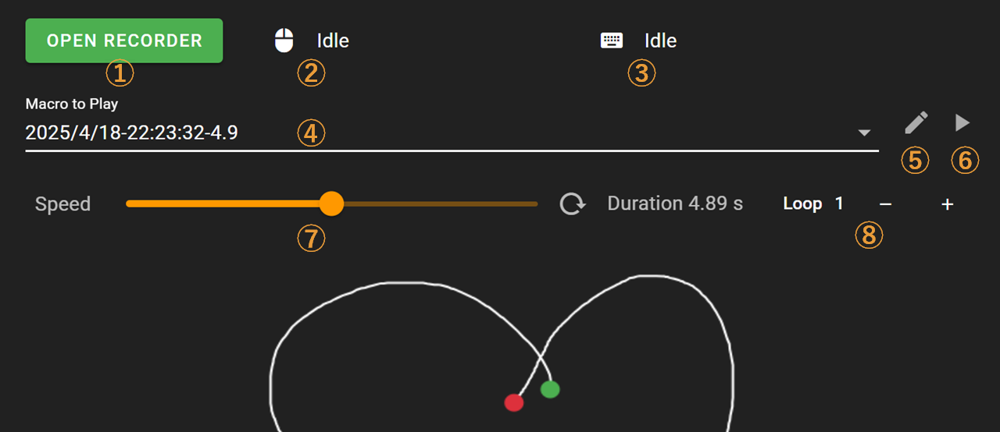
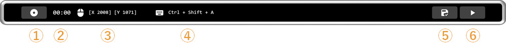

# Macro Player

The macro player key executes recorded keyboard and mouse macros when pressed.

## In the FlexDesigner

1. Open the recorder interface on Flexbar
2. Current mouse coordinates
3. Currently pressed keys
4. Select a saved recording
5. Edit/delete recordings
6. Test the selected recording, **Note: clicking this will immediately play your recorded macro**
7. Adjust playback speed
8. Set the number of times to play the recording

Click `OPEN RECORDER` to start recording a macro. You'll need to complete the recording on your Flexbar.

1. Start/Stop recording
2. Recording duration (MM:SS)
3. Current mouse coordinates
4. Currently pressed keys
5. Save this recording
6. Play/Stop this recording

After saving your recording, it will appear in the Function Tab where you can select and use your previously recorded macros.

Once you've selected a recorded macro and uploaded it to your Flexbar, simply press this key on your Flexbar to play the macro.
