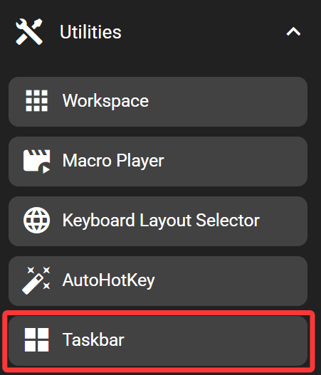

# Taskbar

The taskbar key shows all opened windows similar to a taskbar.

This key only works when the FlexDesigner is running. This key is only present in the Windows version of the FlexDesigner.

## In the FlexDesigner

## On the Flexbar

The title for all opened windows are shown in the allocated area. Press the window to switch it to the foreground.
