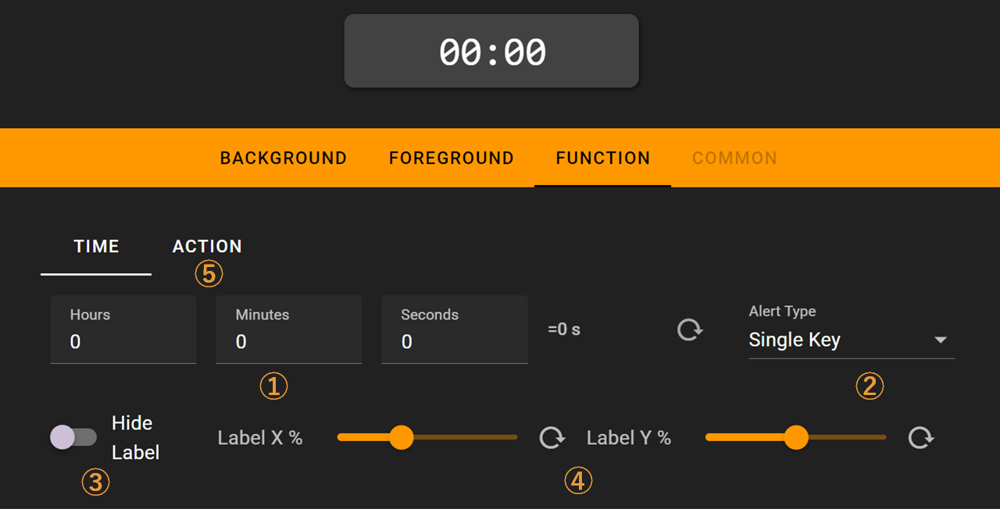

# Timer

A countdown timer that can perform a sequence of actions when the timer starts or ends. You can configure alarms for when the timer finishes.

## In the FlexDesigner

1. Set the countdown duration
2. Choose the alarm type when countdown ends: disabled, button alarm, or full-screen alarm
3. Option to hide the countdown time display
4. Position of the countdown time display
5. Actions to execute when the countdown starts/ends, configured the same way as [Sequenced Keys](../more/sequenced_keys.md)

## On the Flexbar

When the countdown starts, a semi-transparent black overlay shows the progress. An alarm will sound when the countdown ends.

Full-screen alarm:

Long-press the timer button on the Flexbar to quickly open the time settings. Drag the slider to adjust the countdown duration.

