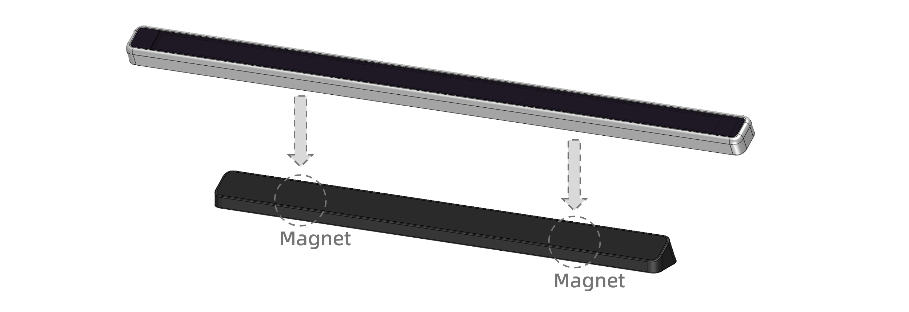

# Flexbar Quick Start Guide

## What is Flexbar?

Flexbar is your versatile, fully customizable shortcut management system. It represents a new type of shortcut keyboard, equipped with multifunctional keys capable of executing operations that typically require complex mouse and keyboard actions. From simple commands like sending Ctrl+Z, to complicated professional software shortcuts that are hard to remember—once set up, Flexbar can handle them effortlessly. Unlike traditional keyboards, Flexbar can even perform actions that normal keyboards cannot, such as inserting entire text paragraphs, emojis, or even GIFs, all achievable with a single touch. Its convenient hierarchical pages and scrolling functions let you configure countless buttons. Additionally, there are many more functions awaiting your exploration.

**Flexbar = Keyboard + Mouse + More**

## Where can I use Flexbar?

As you can see, Flexbar is designed as a slim touchscreen bar, perfect for placement above or below your keyboard or monitor, suitable for both laptops and desktops. The included magnetic stand allows you to position it at a comfortable angle anywhere convenient, adding stability through its weight.

> The detachable angled stand includes built-in magnets that attach securely to the middle of Flexbar’s back panel. Note that the Flexbar itself doesn't contain magnets.
>
> Included silicone pads can optionally be placed at both ends on the back of the Flexbar, improving friction on smooth surfaces and protecting your laptop’s finish.
>
> If you prefer a custom-made stand, we provide a 3D reference file detailing the dimensions and magnetic positions of the Flexbar for your convenience. [Link?]

## Check Your Accessories

Your package should contain the following items:

- Flexbar
- Type-C to Type-C Cable
- Magnetic Base

## Connecting Flexbar to Your Device:

Use the provided USB Type-C data cable (or any USB cable capable of data transmission, regardless of connector type) to connect your Flexbar to your device. Flexbar only requires basic USB 2.0 data communication and a 5V power supply under 500mA. Theoretically, any device supporting external USB keyboards and mice can use Flexbar, including but not limited to PCs, tablets like iPads, smartphones, and industrial control hosts.

> Initial configuration of Flexbar requires a device supporting the FlexDesigner software (Windows, Mac, Linux). Once configured and uploaded, the button configurations are stored on the Flexbar itself, allowing it to be moved freely between different devices. (Limited to basic keyboard/mouse shortcuts.)
>
> Unfortunately, due to size constraints, Flexbar does not include a built-in battery or wireless functionality. Stay tuned for updates on future product iterations.

## Using Flexbar and FlexDesigner for the First Time:

Flexbar comes with a simple tutorial pre-installed to help you get started. Later, you can customize your own unique shortcut profiles using our desktop software, [FlexDesigner](https://eniacelec.com/pages/software), and upload them to your Flexbar.

To help you quickly get started, a factory-default profile without the tutorial is also available [factory.flexbar](../assets/factory-v1.flexbar). Additional profiles and functional key sets are provided on our online platform [FlexMarketplace](https://flexmarketplace.eniacelec.com/home/index), where you can freely download, import, and kickstart your shortcut journey.

> Due to its multifunctional nature, we strongly recommend thoroughly reading the Flexbar and FlexDesigner tutorials.
>
> Individual pages within profiles can be separately exported and imported, allowing you to use only the parts you need.

## Terminology:

#### FlexDesigner:

FlexDesigner is software provided by us for customizing Flexbar functionalities, software updates, and supporting advanced features. Available for Windows, Mac, and Linux, it does not affect your ability to use basic keyboard and mouse functions on devices without FlexDesigner installed. [Download Link](https://eniacelec.com/pages/software)

#### Profile:

A profile contains all the keys' appearance, functionality, and page logic configured for display on the Flexbar via FlexDesigner. Profiles can be shared and edited, and uploaded to compatible Flexbar devices through FlexDesigner, but cannot be downloaded back from Flexbar to your computer.

#### Keys:

Small square-shaped functional components displayed on Flexbar are called "keys". Depending on their specific functions, not all keys necessarily perform interactive "button-like" actions. [How to use](flexdesigner/index.html)

#### Firmware:

Firmware refers to the embedded software written into Flexbar’s internal microcontroller, pre-installed at the factory. Updates to firmware are prompted via FlexDesigner when available. We recommend regularly updating to ensure access to the latest features and improved stability. Firmware can also be manually rolled back or updated in special cases—details available at [Firmware Update and Rollback].

#### FlexGate:

FlexGate is our official platform dedicated to sharing profiles and plug-ins for Flex series products [FlexGate Link]. Users can upload and download pre-configured shortcut sets. Officially provided sets are also available for convenience. After downloading, you can freely combine or edit them via FlexDesigner’s page import/export functions and integrate them into your Flexbar Profile. [FlexGate User Guide]

#### Plug-in:

The plug-in system is an open-source software platform designed to allow developers and users with additional needs to create and integrate new functionalities into Flexbar. Users can independently develop and run features alongside built-in functionalities, optionally sharing their creations on the FlexGate platform for community use.

## FAQ:

**Q:** Why are Flexbar keys called "keys" instead of "buttons"?

**A:** Because we define Flexbar as a specialized multifunctional touchscreen keyboard, rather than a "button board".

**Q:** Why is it called "Flex" when Flexbar itself isn't flexible?

**A:** Although physically rigid, Flexbar’s functionality is highly flexible, hence the name "Flexbar".

**Q:** Why is there no wireless version available?

**A:** Due to size limitations designed for laptop compatibility, Flexbar is already as compact as possible. With current battery technology, achieving reasonable battery life for a screen of this size is not yet feasible. However, we continue researching new forms and possibilities, potentially including a wireless version in the future.

**Q:** What is ENIAC?

**A:** ENIAC (Electronic Numerical Integrator and Computer) was the world's first digital electronic general-purpose computer [Link]. Built in 1954 using vacuum tubes and relays, it weighed many tons and offered the performance of about half a modern portable calculator. It is also the longtime online pseudonym used by our founder.

**Q:** Is Flexbar or the Flex series open-source?

**A:** We are a small developer team that wishes to open-source our work, but commercial considerations prevent immediate full open-sourcing. Currently, we provide an open-source plug-in system for users to customize Flexbar functionality [GitHub/ENIACelec], and we closely collaborate with the open-source community. More components may be gradually open-sourced in the future, and possibly entirely open-source products will be released.

## Next Steps

- Check out the [SDK documentation](sdk/index.html) to learn how to create custom plugins
- Explore the [Functions documentation](functions/index.html) to see what you can do with Flexbar
- Visit the [FlexDesigner documentation](flexdesigner/index.html) to learn how to customize your Flexbar
