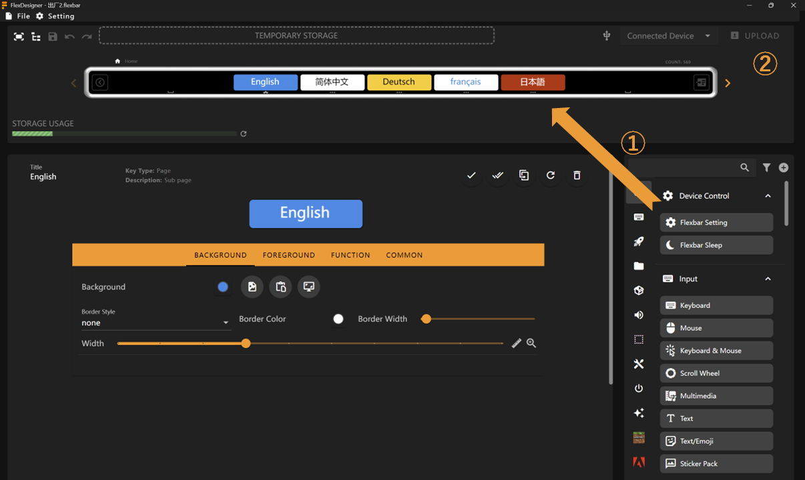

# Getting Started

Thank you for supporting Flexbar

This document provides instructions on how to quickly set up and start using your Flexbar.

> This document is still under development

## Check Your Accessories

Your package should contain the following items:

- Flexbar
- Type-C to Type-C Cable
- Magnetic Base

## Connect to Your Computer

Connect the Flexbar to any USB port on your computer using the Type-C cable. You should see the Flexbar light up and vibrate when properly connected.

## Install FlexDesigner

FlexDesigner is used to customize Flexbar's functionality. Some of Flexbar's features also require FlexDesigner to be running.

For the most complete experience, please visit our official website to download the latest version of FlexDesigner: [Download Link](https://eniacelec.com/pages/software)

FlexDesigner is available for Windows, macOS, and Linux.

## Create Your First Custom Page

Install and open FlexDesigner.

Simply drag and drop keys of interest from the button library on the right onto your Flexbar. Click the upload button in the top-right corner to upload your configuration to the Flexbar. The Flexbar will automatically restart and apply the changes shortly after.

> In case you want to revert to the factory profile, download [factory.flexbar](../assets/factory-v1.flexbar) and open it by FlexDesigner.

## Next Steps

- Check out the [SDK documentation](sdk/index.html) to learn how to create custom plugins
- Explore the [Functions documentation](functions/index.html) to see what you can do with Flexbar
- Visit the [FlexDesigner documentation](flexdesigner/index.html) to learn how to customize your Flexbar
